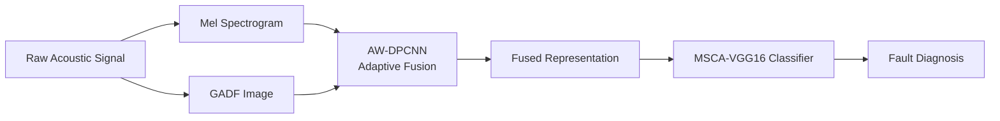

# AW-DPCNN: Adaptive Weighted Dual-Channel PCNN for Multi-Representation Acoustic Signal Fusion

[](https://www.python.org/)
[](https://pytorch.org/)
[](https://developer.nvidia.com/cuda-toolkit)
[]()

**AW-DPCNN** is a reproducible deep learning research framework for **acoustic fault diagnosis** via multi-representation signal fusion. Two complementary representations — **Mel spectrograms** (time–frequency) and **Gramian Angular Difference Field (GADF)** images (temporal correlation) — are adaptively fused through a contrast-guided dual-channel PCNN, then classified by a multi-scale channel attention enhanced VGG16 network (MSCA-VGG16).

> **Paper:** *AW-DPCNN Based Multi-Representation and MSCA-VGG16 Signal Fusion for Fault Diagnosis* — under review at *IEEE TIM*.

---

## Table of Contents

1. [Project Structure](#1-project-structure)
2. [Methodology Overview](#2-methodology-overview)
3. [Quick Start](#3-quick-start)
4. [Dataset Construction](#4-dataset-construction)
5. [Running Experiments](#5-running-experiments)
6. [Evaluation & Visualization](#6-evaluation--visualization)
7. [Output Artifacts](#7-output-artifacts)
8. [Models](#8-models)
9. [Environment](#9-environment)
10. [Citation](#citation)

---

## 1) Project Structure

```text
AW-DPCNN/
├── configs/
│   └── default.yaml                 # Global default configuration
│
├── datasets/                        # Built datasets (ImageFolder format)
│   ├── cwru_de/                     # CWRU 12k DE (10 classes, 60/20/20 split)
│   ├── ablation/                    # 5 fusion variants
│   │   ├── mel_only/                # B0 — Mel pseudo-colour only
│   │   ├── gadf_only/               # B1 — GADF pseudo-colour only
│   │   ├── concat/                  # B2 — Pixel-wise average fusion
│   │   ├── awdpcnn_gamma1/          # B3 — AW-DPCNN γ=1 (equal weight)
│   │   └── awdpcnn_full/            # B4–B8 — AW-DPCNN γ=10 (full fusion)
│   └── rep_compare_12k_de_split/    # 12 TF×temporal combos
│
├── src/                             # Core library
│   ├── models/
│   │   ├── registry.py              # Model builder (build_model)
│   │   ├── MSCA_VGG16.py            # ⭐ Proposed MSCA-VGG16
│   │   ├── vgg16.py                 # VGG16-BN (with MS/CA/EH switches)
│   │   ├── convnext_tiny.py         # ConvNeXt-Tiny
│   │   ├── efficientnet.py          # EfficientNet-B0
│   │   ├── mobilenetv3.py           # MobileNetV3-Small
│   │   ├── vit.py                   # Vision Transformer
│   │   └── se_block.py              # SE channel attention block
│   ├── trainers/
│   │   └── workflow.py              # Train/validate/test main loop
│   ├── datasets/
│   │   └── image_classification.py  # ImageFolder dataloader builder
│   └── utils/
│       ├── config.py                # YAML load/merge
│       ├── experiment.py            # Run directory + seed setup
│       ├── aggregation.py           # Mean±std for repeated trials
│       ├── train_eval.py            # Training & evaluation loops
│       ├── metrics.py               # Acc, F1, G-mean, κ, AUC, …
│       ├── plot_confusion.py        # Confusion matrix plotting
│       ├── plot_roc.py              # ROC curve plotting
│       └── tsne.py                  # t-SNE feature visualization
│
├── scripts/                         # Training, evaluation, data processing
│   ├── train.py                     # Unified training entrypoint
│   ├── evaluate.py                  # Evaluation from checkpoint
│   ├── build_cwru_de.py             # CWRU 12k DE dataset builder
│   ├── build_ablation_datasets.py   # B0–B4 ablation dataset builder
│   ├── build_cwru_rep_datasets.py   # 12 TF×temporal rep_compare datasets
│   ├── split_rep_compare.py         # Post-hoc file-level split (symlinks)
│   ├── run_exp1_all.py              # Batch-run backbone comparison
│   ├── run_rep_compare.py           # 12-combo rep_compare + repeated trials
│   ├── run_ablation_experiments.py  # B0–B8 ablation runner
│   ├── run_repeated_trials.py       # Generic repeated trials (mean±std)
│   ├── hyperparameter_sensitivity.py # AW-DPCNN γ, N, α sensitivity sweep
│   ├── noise_robustness.py          # Gaussian noise robustness evaluation
│   ├── plot_model_comparison.py     # t-SNE + confusion matrix aggregation
│   ├── plot_tsne_all.py             # t-SNE comparison across all models
│   └── results_to_latex.py          # Experiment results → IEEE LaTeX tables
│
├── experiments/                     # Experiment configs & results
│   ├── exp1/                        # Backbone comparison (6 models)
│   ├── ablation/                    # B0–B8 component decomposition (9 configs)
│   ├── rep_compare/                 # 12 TF×temporal combinations
│   └── experiment_result/           # All run outputs, aggregated results
│
├── paper/                           # LaTeX manuscript (IEEEtran)
│   ├── tim.tex                      # Main paper source
│   ├── references.bib               # Bibliography
│   ├── IEEEtran.cls / IEEEtran.bst  # IEEE style files
│   └── framework/, AW-DPCNN/, MSCA-VGG16/,
│       tsne/, confusion_matrix/, ROC/  # Figures
│
├── raw-data/                        # CWRU .mat source files
├── requirements.txt
└── README.md
```

---

## 2) Methodology Overview



### Stage 1 — Multi-Representation Encoding

| Representation | Domain | Captures |
|---|---|---|
| **Mel Spectrogram** | Time–Frequency | Spectral energy distribution, perceptually motivated Mel-scale compression |
| **GADF** (Gramian Angular Difference Field) | Angular / Temporal | Global temporal correlation through pairwise angular difference encoding |

Both are rendered as $224 \times 224$ pseudo-colour RGB images via the Viridis colormap.

### Stage 2 — AW-DPCNN Fusion

An **adaptive weighted dual-channel PCNN** that fuses the two heterogeneous representations through:
- **Contrast-guided adaptive weighting** ($\gamma=10$): dynamically emphasises the dominant representation at each spatial location
- **Dual-channel coupling**: representation-specific convolution kernels (stripe $3\times5$ for Mel, symmetric $3\times3$ for GADF)
- **Iterative pulse dynamics** ($N=20$): propagates and reinforces structurally consistent features

### Stage 3 — MSCA-VGG16 Classification

A VGG16-BN backbone augmented with three complementary modules:

| Module | Description |
|---|---|
| **Multi-Scale Convolution (MS)** | $3\times3$, $5\times5$, and dilated $3\times3$ parallel branches |
| **Channel Attention (CA)** | SE-style squeeze-and-excitation with reduction ratio $r=16$ |
| **Embedding Head (EH)** | 512→1024→256 dimensional projection with BatchNorm + Dropout(0.5) |

**Complexity:** 26.8 M parameters, 15.9 GFLOPs.

---

## 3) Quick Start

### Prerequisites

| Component | Specification |
|---|---|
| Python | 3.10+ |
| PyTorch | 2.11+ |
| CUDA | 12.8 (RTX 5090) |
| OS | Ubuntu |

### Install

```bash
cd AW-DPCNN
pip install -r requirements.txt

# Activate pre-built environment (if available)
source ~/envs/awdpcnn/bin/activate
export PYTHONPATH=$(pwd)
```

### Single Training Run

```bash
# Using the CWRU DE dataset
python scripts/train.py \
    --config configs/default.yaml \
    --exp-config experiments/exp1/MSCA_VGG16.yaml

# Override seed for repeated trials
python scripts/train.py \
    --config configs/default.yaml \
    --exp-config experiments/exp1/MSCA_VGG16.yaml \
    --seed 123
```

### Evaluate a Trained Checkpoint

```bash
python scripts/evaluate.py \
    --config experiments/experiment_result/<exp>/<run>/resolved_config.yaml \
    --checkpoint experiments/experiment_result/<exp>/<run>/checkpoints/best.pt
```

---

## 4) Dataset Construction

### 4.1 CWRU 12k DE Dataset (10 classes)

Builds from raw CWRU `.mat` files with file-level 60/20/20 split (seed=42). Includes all three fault severities (0.007'', 0.014'', 0.021'') across Ball, Inner Race, and Outer Race faults plus Normal baseline.

```bash
python scripts/build_cwru_de.py --workers 32
```

Output: `datasets/cwru_de/{train,val,test}/{BF007,…,BF021,IF007,…,OF021,Normal}/`

### 4.2 Ablation Datasets (5 variants)

Builds B0–B4 fusion variants for component decomposition experiments:

| Dataset | Description | Used in |
|---|---|---|
| `mel_only` | Mel pseudo-colour only (no fusion) | B0 |
| `gadf_only` | GADF pseudo-colour only (no fusion) | B1 |
| `concat` | Pixel-wise average of Mel + GADF | B2 |
| `awdpcnn_gamma1` | AW-DPCNN γ=1 (equal weight) | B3 |
| `awdpcnn_full` | AW-DPCNN γ=10 (full adaptive) | B4–B8 |

```bash
python scripts/build_ablation_datasets.py --workers 32
```

### 4.3 Representation Comparison Datasets (12 combos)

All combinations of 3 time–frequency methods × 4 temporal encoding methods:

| TF Methods | Temporal Methods |
|---|---|
| Mel, STFT, CWT | GADF, GASF, MTF, RP |

```bash
# Step 1: Build fused images (no split — class folders directly)
python scripts/build_cwru_rep_datasets.py --workers 32

# Step 2: Create file-level train/val/test split via symlinks
python scripts/split_rep_compare.py --workers 32
```

Output: `datasets/rep_compare_12k_de_split/{mel_gadf,…,cwt_rp}/{train,val,test}/`

---

## 5) Running Experiments

### 5.1 Backbone Comparison

6 models on the CWRU DE dataset with AW-DPCNN fused representations:

```bash
# Single run (seed=42)
python scripts/run_exp1_all.py \
    --config configs/default.yaml \
    --exp-dir experiments/exp1

# 3 independent trials with mean ± std (publication-ready)
python scripts/run_repeated_trials.py \
    --config configs/default.yaml \
    --exp-dir experiments/exp1 \
    --num-runs 3
```

### 5.2 Ablation Study (B0–B8)

Systematic component decomposition across 9 configurations:

| Tier | Experiments | Classifier | What varies |
|---|---|---|---|
| **Fusion** (B0–B4) | B0, B1, B2, B3, B4 | VGG16 | Mel-only, GADF-only, Concat, γ=1, γ=10 |
| **Classifier** (B5–B8) | B5, B6, B7, B8 | MSCA-VGG16 | MS, CA, EH component switches |

```bash
python scripts/run_ablation_experiments.py --epochs 30
```

### 5.3 Representation Comparison (12 combos)

Evaluates all 12 TF×temporal combinations under identical training settings using VGG16-BN.

```bash
# Single trial per combo
python scripts/run_rep_compare.py --num-workers 32

# 3 independent trials with mean±std aggregation
python scripts/run_rep_compare.py --num-workers 32 --num-trials 3

# Single combo only
python scripts/run_rep_compare.py --combo mel_gadf --num-workers 32 --num-trials 3

# Aggregate existing results without re-training
python scripts/run_rep_compare.py --aggregate-only --num-trials 3
```

### 5.4 Hyperparameter Sensitivity

Sweeps AW-DPCNN parameters ($\gamma$, $N$, $\alpha$) against a frozen MSCA-VGG16 classifier:

```bash
python scripts/hyperparameter_sensitivity.py \
    --config configs/default.yaml \
    --exp-config experiments/exp1/MSCA_VGG16.yaml \
    --auto-checkpoint
```

### 5.5 Noise Robustness

Evaluates models under additive Gaussian noise at SNR levels from 0–30 dB:

```bash
python scripts/noise_robustness.py \
    --config configs/default.yaml \
    --exp-dir experiments/exp1 \
    --auto-checkpoint
```

---

## 6) Evaluation & Visualization

### Metrics

All metrics are **macro-averaged** to ensure balanced evaluation across classes:

| Metric | Description |
|---|---|
| **Accuracy** | Overall correct prediction rate |
| **Precision** | Macro-averaged positive predictive value |
| **Recall** | Macro-averaged true positive rate |
| **F1-Score** | Harmonic mean of precision and recall |
| **G-Mean** | Geometric mean of per-class recall |
| **Balanced Accuracy** | Mean of per-class recall |
| **Cohen's $\kappa$** | Agreement beyond chance |
| **ROC-AUC** | Macro-averaged area under the ROC curve (One-vs-Rest) |

### Visualization Scripts

```bash
# t-SNE comparison across all models
python scripts/plot_tsne_all.py

# Aggregated model comparison (t-SNE + confusion matrices)
python scripts/plot_model_comparison.py

# Multi-subplot comparison figure
python scripts/plot_model_comparison_subplot.py
```

### LaTeX Table Generation

Auto-generates IEEE-formatted tables from experiment results:

```bash
python scripts/results_to_latex.py
```

---

## 7) Output Artifacts

Each run creates a directory under `output.root_dir`:

```text
experiments/experiment_result/<exp_name>/<run_name>/
├── resolved_config.yaml          # Merged full configuration
├── checkpoints/
│   ├── best.pt                   # Best validation F1 checkpoint
│   └── last.pt                   # Final epoch checkpoint
├── logs/
│   └── train_log.csv             # Per-epoch train/val metrics
├── results/
│   └── test_metrics.json         # Final test-set metrics
└── figures/
    ├── confusion_matrix.png      # Confusion matrix
    ├── tsne.png                  # t-SNE feature visualization
    └── roc_curve.png             # ROC curves (if enabled)
```

**Repeated trials** add an `aggregated/` directory:

```text
aggregated/
├── aggregated_metrics.json       # {mean, std, min, max, trials, values}
├── aggregated_metrics.csv        # CSV table
└── aggregated_metrics.md         # Publication-ready Markdown table
```

### Configuration System

Experiments use a **base + override** YAML deep-merge pattern. The base config (`configs/default.yaml`) provides defaults; experiment YAMLs override specific fields.

```yaml
# Example experiment override
experiment_name: exp1_MSCA_VGG16
model:
  name: MSCA_VGG16
  num_classes: 10
  pretrained: true
train:
  epochs: 30
  lr: 1e-4
  optimizer: adamw
scheduler:
  type: plateau
  mode: max
  factor: 0.5
  patience: 5
  min_lr: 0.000001
output:
  root_dir: ./experiments/experiment_result/exp1/MSCA_VGG16
```

---

## 8) Models

Set `model.name` in your experiment YAML:

| Key | Architecture | Params | Highlights |
|---|---|---|---|
| `MSCA_VGG16` ⭐ | VGG16-BN + MS + CA + Embedding | 26.8 M | **Proposed** — multi-scale channel attention |
| `vgg16` | VGG16-BN | 15.3 M | Classical CNN backbone |
| `convnext_tiny` | ConvNeXt-Tiny | 27.8 M | Modernised CNN design |
| `efficientnet_b0` | EfficientNet-B0 | 4.0 M | NAS-optimised lightweight model |
| `mobilenetv3_small` | MobileNetV3-Small | 1.5 M | Mobile-first efficient CNN |
| `vit` | ViT-B/16 | 11.0 M | Pure self-attention transformer |

All models support ImageNet pretrained weights via `model.pretrained: true`.

---

## 9) Environment

| Component | Specification |
|---|---|
| GPU | NVIDIA GeForce RTX 5090 (32 GB) |
| CUDA | 12.8 |
| CPU | Intel i9-14900K |
| OS | Ubuntu |
| Python | 3.10 |
| PyTorch | 2.11 |
| torchvision | 0.16 |

```bash
# Verify GPU
python -c "import torch; print(f'CUDA: {torch.cuda.is_available()} | Device: {torch.cuda.get_device_name(0)}')"
```

---

## Citation

```bibtex
@article{yang2025awdpcnn,
  title   = {AW-DPCNN Based Multi-Representation and MSCA-VGG16
             Signal Fusion for Fault Diagnosis},
  author  = {Chen Yang and Zonglong Bai and Zhiyuan Xie and
             Chenggang Liu and Junyan Zhang and Yihe Guo},
  journal = {IEEE Transactions on Instrumentation and Measurement},
  year    = {2025},
  note    = {Under review}
}
```

## License

MIT License.

---

**Author:** Chen Yang · [chen1052554665@gmail.com](mailto:chen1052554665@gmail.com) · North China Electric Power University (NCEPU)
