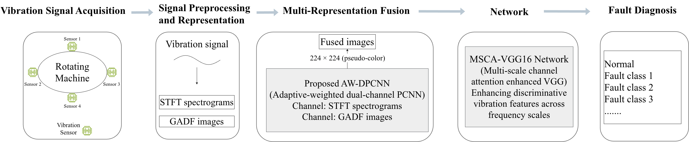
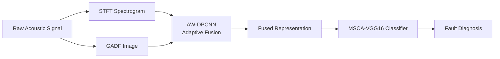
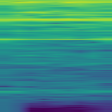
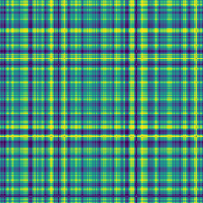
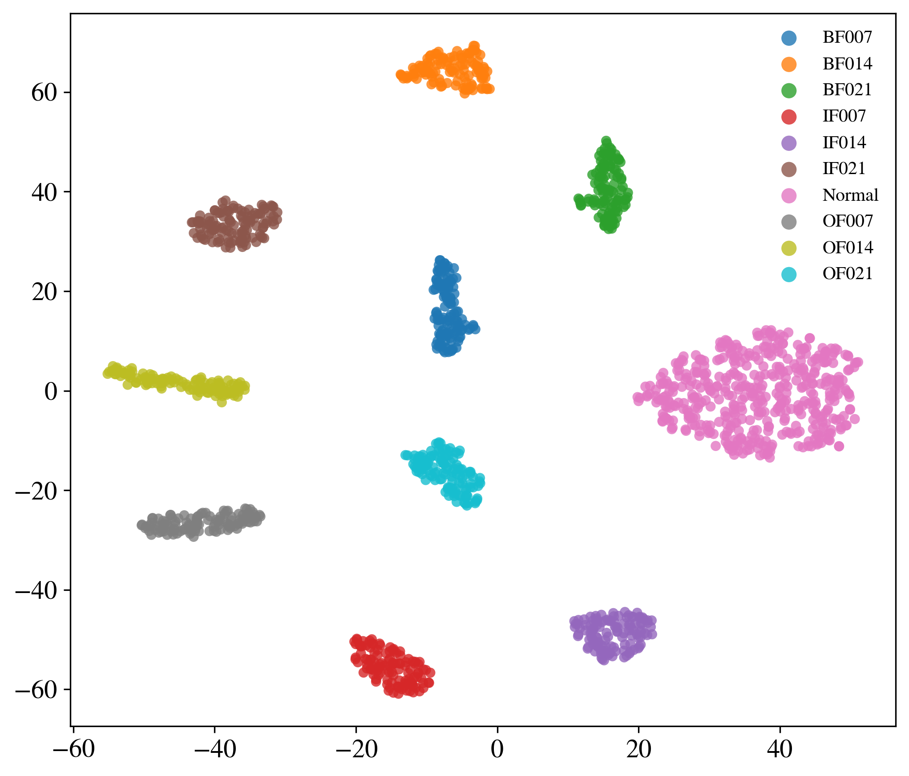
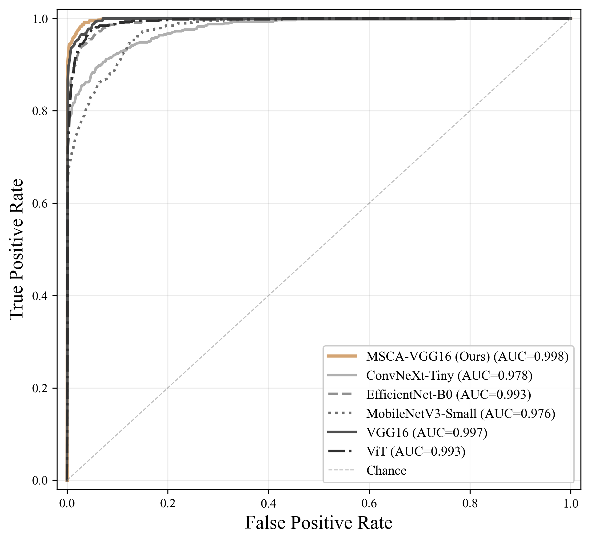
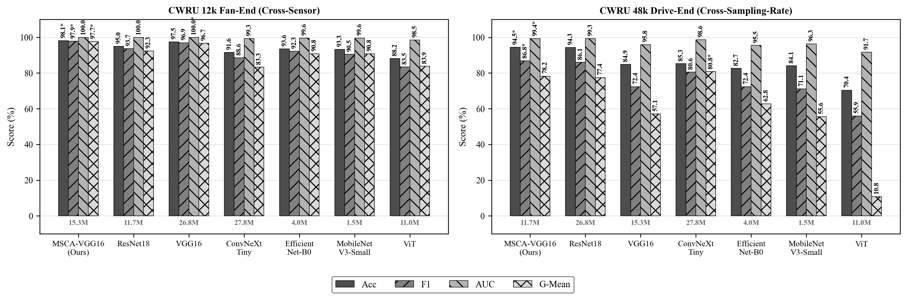
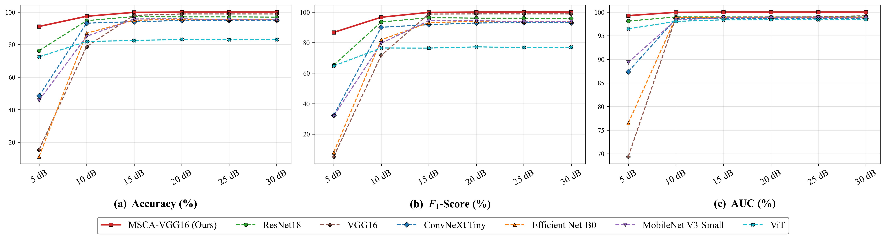

# AW-DPCNN: Adaptive Weighted Dual-Channel PCNN for Multi-Representation Signal Fusion

[](https://www.python.org/)
[](https://pytorch.org/)
[](https://developer.nvidia.com/cuda-toolkit)
[]()

**AW-DPCNN** is a reproducible deep learning research framework for **fault diagnosis** via multi-representation signal fusion. Two complementary representations, i.e., **STFT spectrograms** (time frequency) and **Gramian Angular Difference Field (GADF)** images (temporal correlation)  are adaptively fused through a contrast-guided dual-channel PCNN, then classified by a multi-scale channel attention enhanced VGG16 network (MSCA-VGG16).

> **Manuscript:** *Adaptive Multi-Representation Fusion via Dual-Channel PCNN with Multi-Scale Convolution for Vibration Signal Fault Diagnosis* — under review at `Signal, Image and Video Processing`.

## Table of Contents

1. [Problem Statement](#problem-statement)
2. [Proposed Method](#2-proposed-method)
3. [Key Results](#3-key-results)
4. [Project Structure](#4-project-structure)
5. [Quick Start](#5-quick-start)
6. [Dataset Construction](#6-dataset-construction)
7. [Running Experiments](#7-running-experiments)
8. [Evaluation &amp; Visualization](#8-evaluation--visualization)
9. [Output Artifacts](#9-output-artifacts)
10. [Models](#10-models)
11. [Environment](#11-environment)
12. [Citation](#citation)

## Problem Statement

Rotating machinery fault diagnosis via vibration signals faces a fundamental challenge: **single-representation methods cannot fully capture the discriminative features embedded in non-stationary vibration signals**.

- **Time–frequency representations** (e.g., STFT or Mel spectrograms) capture local spectral energy distributions but do not explicitly model long-range temporal correlations.
- **Temporal encoding methods** (e.g., GAF or RP) preserve global pairwise temporal relationships but discard explicit frequency-domain structure.
- **Naive fusion** (concatenation, pixel-wise averaging) ignores the heterogeneous statistical properties of different representations, often introducing **destructive interference** rather than constructive complementarity.

To address these limitations, we propose a two-stage framework:

1. **AW-DPCNN**: an adaptive weighted dual-channel pulse-coupled neural network that fuses STFT spectrograms and GADF images via contrast-guided dynamic weighting, representation-specific convolutional kernels ($3\times5$ stripe for STFT, $3\times3$ symmetric for GADF), and iterative pulse-coupled dynamics ($N=20$).
2. **MSCA-VGG16**: a multi-scale channel attention enhanced VGG16 classifier that exploits the complementary information in fused representations for robust fault identification under noisy conditions.

## Proposed Method

The AW-DPCNN framework operates in three stages: **(i)** multi-representation encoding of raw vibration signals into complementary STFT and GADF images, **(ii)** adaptive fusion via contrast-guided dual-channel PCNN, and **(iii)** classification with a multi-scale channel attention enhanced VGG16 network.

<!--  -->



### Stage 1: Multi-Representation Encoding

| Representation                                    | Domain               | Captures                                                             |
| ------------------------------------------------- | -------------------- | -------------------------------------------------------------------- |
| **STFT Spectrogram**                        | Time–Frequency      | Joint time–frequency energy distribution; local spectral evolution  |
| **GADF** (Gramian Angular Difference Field) | Angular or Temporal | Global pairwise temporal correlation via angular difference encoding |

Both are rendered as $224 \times 224$ pseudo-colour RGB images via the Viridis colormap.

<table>
<tr>
<td align="center"><b>STFT Spectrogram</b></td>
<td align="center"><b>GADF Image</b></td>
</tr>
<tr>
<td></td>
<td></td>
</tr>
</table>

### Stage 2: AW-DPCNN Fusion

An **adaptive weighted dual-channel PCNN** that fuses the two heterogeneous representations through:

- **Contrast-guided adaptive weighting** ($\gamma=10$): dynamically emphasises the dominant representation at each spatial location
- **Dual-channel coupling**: representation-specific convolution kernels (stripe $3\times5$ for STFT, symmetric $3\times3$ for GADF)
- **Iterative pulse dynamics** ($N=20$): propagates and reinforces structurally consistent features

### Stage 3MSCA-VGG16 Classification

A VGG16-BN backbone augmented with three complementary modules:

| Module                                 | Description                                                            |
| -------------------------------------- | ---------------------------------------------------------------------- |
| **Multi-Scale Convolution (MS)** | $3\times3$, $5\times5$, and dilated $3\times3$ parallel branches |
| **Channel Attention (CA)**       | SE-style squeeze-and-excitation with reduction ratio $r=16$    |
| **Embedding Head (EH)**          | 512→1024→256 dimensional projection with BatchNorm + Dropout(0.5)    |

**Complexity:** 26.8 M parameters, 15.9 GFLOPs.


## 3) Key Results

### 3.1 Backbone Comparison (CWRU 12k DE, 3 trials)

| Model                          |                 Acc (%) |                  F1 (%) |              G-Mean (%) |                  κ (%) |
| ------------------------------ | ----------------------: | ----------------------: | ----------------------: | ----------------------: |
| **MSCA-VGG16 (Ours)** ⭐ | **99.85 ± 0.10** | **99.46 ± 0.43** | **99.82 ± 0.15** | **99.82 ± 0.12** |
| VGG16                          |           99.19 ± 0.89 |           98.95 ± 1.16 |           98.91 ± 1.22 |           99.06 ± 1.05 |
| ResNet18                       |           98.39 ± 1.32 |           97.85 ± 1.81 |           97.66 ± 2.10 |           98.11 ± 1.55 |
| EfficientNet-B0                |           95.74 ± 2.07 |           94.14 ± 3.05 |           93.08 ± 4.09 |           95.00 ± 2.43 |
| MobileNetV3-Small              |           93.69 ± 1.64 |           91.03 ± 2.69 |           87.82 ± 5.30 |           92.60 ± 1.92 |
| ConvNeXt-Tiny                  |           92.93 ± 2.12 |           90.63 ± 2.50 |           88.99 ± 3.11 |           91.70 ± 2.49 |
| ViT                            |           82.35 ± 0.89 |           74.71 ± 2.19 |           64.72 ± 7.53 |           79.30 ± 1.04 |

<table>
<tr>
<td align="center"><b>STFT Spectrogram</b></td>
<td align="center"><b>GADF Image</b></td>
<td align="center"><b>ROC Curves</b></td>
</tr>
<tr>
<td></td>
<td></td>
<td></td>
</tr>
</table>

### 3.2 Ablation Study — Component Contributions

| Config                          |    Fusion    |      MS      |      CA      |      EH      |                 Acc (%) |                  F1 (%) |
| ------------------------------- | :----------: | :----------: | :----------: | :----------: | ----------------------: | ----------------------: |
| B0 — STFT-only                 |      ✗      |      ✗      |      ✗      |      ✗      |           93.37 ± 1.32 |           91.49 ± 2.25 |
| B1 — GADF-only                 |      ✗      |      ✗      |      ✗      |      ✗      |           60.99 ± 1.50 |           56.90 ± 2.13 |
| B2 — Concat fusion             |      ✗      |      ✗      |      ✗      |      ✗      |           96.28 ± 4.49 |           94.91 ± 6.59 |
| B3 — AW-DPCNN (γ=1)           |      ✓      |      ✗      |      ✗      |      ✗      |           96.30 ± 0.49 |           95.02 ± 0.40 |
| B4 — +MS only                  |      ✓      |      ✓      |      ✗      |      ✗      |           96.84 ± 4.01 |           95.83 ± 5.62 |
| B5 — +CA only                  |      ✓      |      ✗      |      ✓      |      ✗      |           98.97 ± 0.83 |           98.88 ± 0.91 |
| B6 — +EH only                  |      ✓      |      ✗      |      ✗      |      ✓      |           98.10 ± 3.09 |           97.72 ± 3.72 |
| **B7 — Full MSCA-VGG16** | **✓** | **✓** | **✓** | **✓** | **99.85 ± 0.10** | **99.46 ± 0.43** |

**Key findings:** Adaptive fusion contributes **+2.93%** over STFT-only (B3 vs. B0). Channel attention (CA) provides the largest single-module gain (**+2.67%**, B5 vs. B3).

### 3.3 Representation Comparison (12 TF × Temporal Combos)

Among all 12 STFT/CWT/Mel × GADF/GASF/MTF/RP combinations tested with VGG16:

|        Rank | Combination              |                 Acc (%) |                  F1 (%) |              G-Mean (%) |
| ----------: | ------------------------ | ----------------------: | ----------------------: | ----------------------: |
| **1** | **STFT + GADF** ⭐ | **96.30 ± 0.49** | **95.02 ± 0.40** | **94.22 ± 0.49** |
|           2 | Mel + RP                 |           94.56 ± 3.61 |           92.55 ± 4.96 |           90.93 ± 6.56 |
|           3 | Mel + MTF                |           94.08 ± 1.08 |           90.94 ± 2.08 |           86.27 ± 4.76 |

**STFT+GADF** is the optimal representation pair, confirming the complementary nature of time–frequency energy distribution and global temporal correlation.

### 3.4 Generalization & Noise Robustness

| Generalization Scenario           |  Accuracy (%) |        F1 (%) |
| --------------------------------- | ------------: | ------------: |
| CWRU 12k DE (primary)             | 99.85 ± 0.10 | 99.46 ± 0.43 |
| CWRU 12k FE (cross-sensor)        | 97.45 ± 1.44 | 97.01 ± 1.72 |
| CWRU 48k DE (cross-sampling-rate) | 94.81 ± 1.74 | 86.43 ± 1.59 |



**Noise Robustness** — Accuracy, F1, and AUC under additive Gaussian noise:


## Project Structure

```text
AW-DPCNN/
├── configs/
│   └── default.yaml                 # Global default configuration
│
├── datasets/                        # Built datasets (ImageFolder format)
│   ├── cwru_de/                     # CWRU 12k DE (10 classes, 60/20/20 split)
│   ├── ablation/                    # 5 fusion variants
│   │   ├── mel_only/                # B0 — Mel pseudo-colour only
│   │   ├── gadf_only/               # B1 — GADF pseudo-colour only
│   │   ├── concat/                  # B2 — Pixel-wise average fusion
│   │   ├── awdpcnn_gamma1/          # B3 — AW-DPCNN γ=1 (equal weight)
│   │   └── awdpcnn_full/            # B4–B8 — AW-DPCNN γ=10 (full fusion)
│   └── rep_compare_12k_de_split/    # 12 TF×temporal combos
│
├── src/                             # Core library
│   ├── models/
│   │   ├── registry.py              # Model builder (build_model)
│   │   ├── MSCA_VGG16.py            # ⭐ Proposed MSCA-VGG16
│   │   ├── vgg16.py                 # VGG16-BN (with MS/CA/EH switches)
│   │   ├── convnext_tiny.py         # ConvNeXt-Tiny
│   │   ├── efficientnet.py          # EfficientNet-B0
│   │   ├── mobilenetv3.py           # MobileNetV3-Small
│   │   ├── vit.py                   # Vision Transformer
│   │   └── se_block.py              # SE channel attention block
│   ├── trainers/
│   │   └── workflow.py              # Train/validate/test main loop
│   ├── datasets/
│   │   └── image_classification.py  # ImageFolder dataloader builder
│   └── utils/
│       ├── config.py                # YAML load/merge
│       ├── experiment.py            # Run directory + seed setup
│       ├── aggregation.py           # Mean±std for repeated trials
│       ├── train_eval.py            # Training & evaluation loops
│       ├── metrics.py               # Acc, F1, G-mean, κ, AUC, …
│       ├── plot_confusion.py        # Confusion matrix plotting
│       ├── plot_roc.py              # ROC curve plotting
│       └── tsne.py                  # t-SNE feature visualization
│
├── scripts/                         # Training, evaluation, data processing
│   ├── train.py                     # Unified training entrypoint
│   ├── evaluate.py                  # Evaluation from checkpoint
│   ├── build_cwru_de.py             # CWRU 12k DE dataset builder
│   ├── build_ablation_datasets.py   # B0–B4 ablation dataset builder
│   ├── build_cwru_rep_datasets.py   # 12 TF×temporal rep_compare datasets
│   ├── split_rep_compare.py         # Post-hoc file-level split (symlinks)
│   ├── run_exp1_all.py              # Batch-run backbone comparison
│   ├── run_rep_compare.py           # 12-combo rep_compare + repeated trials
│   ├── run_ablation_experiments.py  # B0–B8 ablation runner
│   ├── run_repeated_trials.py       # Generic repeated trials (mean±std)
│   ├── hyperparameter_sensitivity.py # AW-DPCNN γ, N, α sensitivity sweep
│   ├── noise_robustness.py          # Gaussian noise robustness evaluation
│   ├── plot_model_comparison.py     # t-SNE + confusion matrix aggregation
│   ├── plot_tsne_all.py             # t-SNE comparison across all models
│   └── results_to_latex.py          # Experiment results → IEEE LaTeX tables
│
├── experiments/                     # Experiment configs & results
│   ├── exp1/                        # Backbone comparison (6 models)
│   ├── ablation/                    # B0–B8 component decomposition (9 configs)
│   ├── rep_compare/                 # 12 TF×temporal combinations
│   └── experiment_result/           # All run outputs, aggregated results
│
├── paper/                           # LaTeX manuscript (IEEEtran)
│   ├── tim.tex                      # Main paper source
│   ├── references.bib               # Bibliography
│   ├── IEEEtran.cls / IEEEtran.bst  # IEEE style files
│   └── framework/, AW-DPCNN/, MSCA-VGG16/,
│       tsne/, confusion_matrix/, ROC/  # Figures
│
├── raw-data/                        # CWRU .mat source files
├── requirements.txt
└── README.md
```

## 5) Quick Start

### Prerequisites

| Component | Specification   |
| --------- | --------------- |
| Python    | 3.10+           |
| PyTorch   | 2.11+           |
| CUDA      | 12.8 (RTX 5090) |
| OS        | Ubuntu          |

### Install

```bash
cd AW-DPCNN
pip install -r requirements.txt

# Activate pre-built environment (if available)
source ~/envs/awdpcnn/bin/activate
export PYTHONPATH=$(pwd)
```

### Single Training Run

```bash
# Using the CWRU DE dataset
python scripts/train.py \
    --config configs/default.yaml \
    --exp-config experiments/exp1/MSCA_VGG16.yaml

# Override seed for repeated trials
python scripts/train.py \
    --config configs/default.yaml \
    --exp-config experiments/exp1/MSCA_VGG16.yaml \
    --seed 123
```

### Evaluate a Trained Checkpoint

```bash
python scripts/evaluate.py \
    --config experiments/experiment_result/<exp>/<run>/resolved_config.yaml \
    --checkpoint experiments/experiment_result/<exp>/<run>/checkpoints/best.pt
```


## 6) Dataset Construction

### 6.1 CWRU 12k DE Dataset (10 classes)

Builds from raw CWRU `.mat` files with file-level 60/20/20 split (seed=42). Includes all three fault severities (0.007'', 0.014'', 0.021'') across Ball, Inner Race, and Outer Race faults plus Normal baseline.

```bash
python scripts/build_cwru_de.py --workers 32
```

Output: `datasets/cwru_de/{train,val,test}/{BF007,…,BF021,IF007,…,OF021,Normal}/`

### 6.2 Ablation Datasets (5 variants)

Builds B0–B4 fusion variants for component decomposition experiments:

| Dataset            | Description                         | Used in |
| ------------------ | ----------------------------------- | ------- |
| `mel_only`       | Mel pseudo-colour only (no fusion)  | B0      |
| `gadf_only`      | GADF pseudo-colour only (no fusion) | B1      |
| `concat`         | Pixel-wise average of Mel + GADF    | B2      |
| `awdpcnn_gamma1` | AW-DPCNN γ=1 (equal weight)        | B3      |
| `awdpcnn_full`   | AW-DPCNN γ=10 (full adaptive)      | B4–B8  |

```bash
python scripts/build_ablation_datasets.py --workers 32
```

### 6.3 Representation Comparison Datasets (12 combos)

All combinations of 3 time–frequency methods × 4 temporal encoding methods:

| TF Methods     | Temporal Methods    |
| -------------- | ------------------- |
| Mel, STFT, CWT | GADF, GASF, MTF, RP |

```bash
# Step 1: Build fused images (no split — class folders directly)
python scripts/build_cwru_rep_datasets.py --workers 32

# Step 2: Create file-level train/val/test split via symlinks
python scripts/split_rep_compare.py --workers 32
```

Output: `datasets/rep_compare_12k_de_split/{mel_gadf,…,cwt_rp}/{train,val,test}/`


## 7) Running Experiments

### 7.1 Backbone Comparison

6 models on the CWRU DE dataset with AW-DPCNN fused representations:

```bash
# Single run (seed=42)
python scripts/run_exp1_all.py \
    --config configs/default.yaml \
    --exp-dir experiments/exp1

# 3 independent trials with mean ± std (publication-ready)
python scripts/run_repeated_trials.py \
    --config configs/default.yaml \
    --exp-dir experiments/exp1 \
    --num-runs 3
```

### 7.2 Ablation Study (B0–B8)

Systematic component decomposition across 9 configurations:

| Tier                          | Experiments        | Classifier | What varies                              |
| ----------------------------- | ------------------ | ---------- | ---------------------------------------- |
| **Fusion** (B0–B4)     | B0, B1, B2, B3, B4 | VGG16      | Mel-only, GADF-only, Concat, γ=1, γ=10 |
| **Classifier** (B5–B8) | B5, B6, B7, B8     | MSCA-VGG16 | MS, CA, EH component switches            |

```bash
python scripts/run_ablation_experiments.py --epochs 30
```

### 7.3 Representation Comparison (12 combos)

Evaluates all 12 TF×temporal combinations under identical training settings using VGG16-BN.

```bash
# Single trial per combo
python scripts/run_rep_compare.py --num-workers 32

# 3 independent trials with mean±std aggregation
python scripts/run_rep_compare.py --num-workers 32 --num-trials 3

# Single combo only
python scripts/run_rep_compare.py --combo mel_gadf --num-workers 32 --num-trials 3

# Aggregate existing results without re-training
python scripts/run_rep_compare.py --aggregate-only --num-trials 3
```

### 7.4 Hyperparameter Sensitivity

Sweeps AW-DPCNN parameters ($\gamma$, $N$, $\alpha$) against a frozen MSCA-VGG16 classifier:

```bash
python scripts/hyperparameter_sensitivity.py \
    --config configs/default.yaml \
    --exp-config experiments/exp1/MSCA_VGG16.yaml \
    --auto-checkpoint
```

### 7.5 Noise Robustness

Evaluates models under additive Gaussian noise at SNR levels from 0–30 dB:

```bash
python scripts/noise_robustness.py \
    --config configs/default.yaml \
    --exp-dir experiments/exp1 \
    --auto-checkpoint
```

## 8) Evaluation & Visualization

### Metrics

All metrics are **macro-averaged** to ensure balanced evaluation across classes:

| Metric                       | Description                                           |
| ---------------------------- | ----------------------------------------------------- |
| **Accuracy**           | Overall correct prediction rate                       |
| **Precision**          | Macro-averaged positive predictive value              |
| **Recall**             | Macro-averaged true positive rate                     |
| **F1-Score**           | Harmonic mean of precision and recall                 |
| **G-Mean**             | Geometric mean of per-class recall                    |
| **Balanced Accuracy**  | Mean of per-class recall                              |
| **Cohen's $\kappa$** | Agreement beyond chance                               |
| **ROC-AUC**            | Macro-averaged area under the ROC curve (One-vs-Rest) |

### Visualization Scripts

```bash
# t-SNE comparison across all models
python scripts/plot_tsne_all.py

# Aggregated model comparison (t-SNE + confusion matrices)
python scripts/plot_model_comparison.py

# Multi-subplot comparison figure
python scripts/plot_model_comparison_subplot.py
```

### LaTeX Table Generation

Auto-generates IEEE-formatted tables from experiment results:

```bash
python scripts/results_to_latex.py
```

## 9) Output Artifacts

Each run creates a directory under `output.root_dir`:

```text
experiments/experiment_result/<exp_name>/<run_name>/
├── resolved_config.yaml          # Merged full configuration
├── checkpoints/
│   ├── best.pt                   # Best validation F1 checkpoint
│   └── last.pt                   # Final epoch checkpoint
├── logs/
│   └── train_log.csv             # Per-epoch train/val metrics
├── results/
│   └── test_metrics.json         # Final test-set metrics
└── figures/
    ├── confusion_matrix.png      # Confusion matrix
    ├── tsne.png                  # t-SNE feature visualization
    └── roc_curve.png             # ROC curves (if enabled)
```

**Repeated trials** add an `aggregated/` directory:

```text
aggregated/
├── aggregated_metrics.json       # {mean, std, min, max, trials, values}
├── aggregated_metrics.csv        # CSV table
└── aggregated_metrics.md         # Publication-ready Markdown table
```

### Configuration System

Experiments use a **base + override** YAML deep-merge pattern. The base config (`configs/default.yaml`) provides defaults; experiment YAMLs override specific fields.

```yaml
# Example experiment override
experiment_name: exp1_MSCA_VGG16
model:
  name: MSCA_VGG16
  num_classes: 10
  pretrained: true
train:
  epochs: 30
  lr: 1e-4
  optimizer: adamw
scheduler:
  type: plateau
  mode: max
  factor: 0.5
  patience: 5
  min_lr: 0.000001
output:
  root_dir: ./experiments/experiment_result/exp1/MSCA_VGG16
```

## 10) Models

Set `model.name` in your experiment YAML:

| Key                   | Architecture                   | Params | Highlights                                          |
| --------------------- | ------------------------------ | ------ | --------------------------------------------------- |
| `MSCA_VGG16` ⭐     | VGG16-BN + MS + CA + Embedding | 26.8 M | **Proposed** — multi-scale channel attention |
| `vgg16`             | VGG16-BN                       | 15.3 M | Classical CNN backbone                              |
| `convnext_tiny`     | ConvNeXt-Tiny                  | 27.8 M | Modernised CNN design                               |
| `efficientnet_b0`   | EfficientNet-B0                | 4.0 M  | NAS-optimised lightweight model                     |
| `mobilenetv3_small` | MobileNetV3-Small              | 1.5 M  | Mobile-first efficient CNN                          |
| `vit`               | ViT-B/16                       | 11.0 M | Pure self-attention transformer                     |

All models support ImageNet pretrained weights via `model.pretrained: true`.

## 11) Environment

| Component   | Specification                   |
| ----------- | ------------------------------- |
| GPU         | NVIDIA GeForce RTX 5090 (32 GB) |
| CUDA        | 12.8                            |
| CPU         | Intel i9-14900K                 |
| OS          | Ubuntu                          |
| Python      | 3.10                            |
| PyTorch     | 2.11                            |
| torchvision | 0.16                            |

```bash
# Verify GPU
python -c "import torch; print(f'CUDA: {torch.cuda.is_available()} | Device: {torch.cuda.get_device_name(0)}')"
```

## Citation

```bibtex
@article{yang2026awdpcnn,
  title   = {Adaptive Multi-Representation Fusion via Dual-Channel PCNN with Multi-Scale Convolution for Vibration Signal Fault Diagnosis},
  author  = {Chen Yang, Zonglong Bai,Zhiyuan Xie, Chenggang Liu and Junyan Zhang},
  journal = {Signal, Image and Video Processing},
  year    = {2026},
  note    = {Under review}
}
```

## License
This project is provided for research purposes. See the manuscript for institutional affiliations and funding acknowledgments.

<!-- > **Funding:** National Natural Science Foundation of China (No. 12404545), Science Research Project of Hebei Education Department (No. QN2025334), Fundamental Research Funds for the Central Universities (No. 2026MS144). -->

**Author:** Chen Yang · [220242215063@ncepu.edu.cn](mailto:220242215063@ncepu.edu.cn) · North China Electric Power University (NCEPU)
