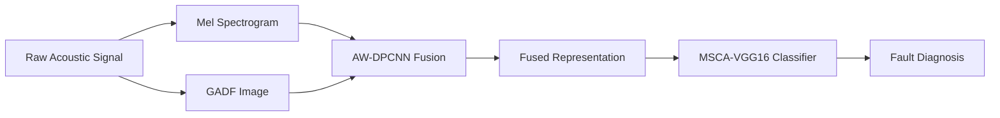

# AW-DPCNN: Adaptive Weighted Dual-Channel PCNN for Multi-Representation Acoustic Signal Fusion

[](https://www.python.org/)
[](https://pytorch.org/)
[](https://developer.nvidia.com/cuda-toolkit)

**AW-DPCNN** is a reproducible deep learning research framework for **transformer acoustic fault diagnosis** via multi-representation signal fusion. The core contributions are:

1. **AW-DPCNN Fusion** — An Adaptive Weighted Dual-Channel Pulse-Coupled Neural Network that fuses Mel spectrograms and Gramian Angular Difference Field (GADF) images into a unified, information-rich representation.
2. **MSCA-VGG16 Classifier** — A Multi-Scale Channel Attention enhanced VGG16 network that exploits complementary fused features for robust fault classification.
3. **Unified Experiment System** — YAML-driven configuration, automatic run directories, and comprehensive evaluation metrics (accuracy, precision, recall, F1, G-Mean, Cohen's $\kappa$, t-SNE, confusion matrices).

> 📄 **Paper:** *AW-DPCNN Based Multi-Representation Acoustic Signal Fusion for Transformer Fault Diagnosis*
> 📊 **Datasets:** Field transformer acoustic data & CWRU bearing benchmark

---

## Table of Contents

- [Project Structure](#1-project-structure)
- [Methodology Overview](#2-methodology-overview)
- [Data Pipeline](#3-data-pipeline)
- [Configuration System](#4-configuration-system)
- [Supported Models](#5-supported-models)
- [Quick Start](#6-quick-start)
- [Running Experiments](#7-running-experiments)
- [Output Artifacts](#8-output-artifacts)
- [Evaluation Metrics](#9-evaluation-metrics)
- [Environment Setup](#10-environment-setup)
- [Authors & Citation](#11-authors--citation)

---

## 1) Project Structure

```text
AW-DPCNN/
├── configs/                          # Base & experiment override YAML configs
│   └── default.yaml                  # Global default configuration
├── datasets/                         # ImageFolder-format datasets (build manually)
├── scripts/                          # Training / evaluation / data processing
│   ├── train.py                      # Unified training entrypoint
│   ├── evaluate.py                   # Evaluation from checkpoint
│   ├── run_exp1_all.py               # Batch-run all exp1 configs
│   ├── build_fused_dataset.py        # ⭐ One-stop dataset builder (Mel→GADF→Fusion)
│   ├── awdpcnn.py                    # AW-DPCNN fusion core algorithm
│   ├── mel.py                        # Mel spectrogram generation
│   ├── GAF.py                        # GASF / GADF image generation
│   ├── cwru_process.py               # CWRU .mat dataset processing
│   ├── built_dataset.py              # Dataset construction utilities
│   ├── data_spilt.py                 # Train/val/test splitting
│   ├── spilt_datasets.py             # Dataset partition tools
│   ├── resample.py                   # Audio resampling
│   ├── segment_wav.py                # WAV segmentation
│   └── smoke_check.py                # Environment sanity check
├── src/                              # Core library
│   ├── models/                       # Model implementations & registry
│   │   ├── registry.py               # Model builder (build_model)
│   │   ├── MSCA_VGG16.py             # ⭐ Proposed MSCA-VGG16
│   │   ├── vgg16_phy.py              # Physics-friendly embedding VGG16
│   │   ├── vgg16_mlff.py             # Multi-level feature fusion VGG16
│   │   ├── vgg16_eh.py               # Enhanced embedding VGG16
│   │   ├── vgg16.py / vgg16_se.py    # Standard / SE VGG16
│   │   ├── resnet18.py / resnet18_se.py
│   │   ├── MS_CBAM_Resnet50.py       # CBAM-enhanced ResNet50
│   │   ├── MS_SE_Resnet50.py         # Multi-scale SE ResNet50
│   │   ├── alexnet_se.py             # SE-AlexNet
│   │   ├── convnext.py / convnext_tiny.py
│   │   ├── efficientnet.py           # EfficientNet-B0
│   │   ├── vit.py                    # Vision Transformer
│   │   ├── CE_ViT.py                 # Channel-Enhanced ViT
│   │   ├── patch_transformer.py      # Patch Transformer
│   │   └── baseline_lenet.py         # LeNet-style baseline CNN
│   ├── trainers/
│   │   └── workflow.py               # Train/validate/test main loop
│   ├── datasets/
│   │   └── image_classification.py   # ImageFolder dataloader builder
│   └── utils/
│       ├── config.py                 # YAML load/merge
│       ├── experiment.py             # Run directory + seed setup
│       ├── train_eval.py             # Training & evaluation loops
│       ├── metrics.py                # 7 classification metrics
│       ├── plot_confusion.py         # Confusion matrix plotting
│       └── tsne.py                   # t-SNE feature visualization
├── experiments/                      # Experiment configs & results
│   ├── exp1/                         # Backbone comparison (17 configs)
│   │   ├── baseline.yaml
│   │   ├── MSCA_VGG16.yaml           # ⭐ Proposed method
│   │   ├── vgg16_phy.yaml / vgg16_mlff.yaml / vgg16_eh.yaml
│   │   ├── resnet18.yaml / resnet18_se.yaml
│   │   ├── MS_CBAM_Resnet50.yaml / MS_SE_Resnet50.yaml
│   │   ├── alexnet_se.yaml
│   │   ├── convnext.yaml / convnext_tiny.yaml
│   │   ├── efficientnet_b0.yaml
│   │   └── vit.yaml / CE_ViT.yaml / patch_transformer.yaml
│   └── ablation/                     # Ablation studies (planned)
├── Paper/                            # LaTeX manuscript (IOP journal format)
│   ├── mst.tex                       # Main paper source
│   ├── references.bib                # Bibliography
│   └── .../                          # Figures (.drawio source files)
├── raw-data/                         # CWRU raw .mat data
├── requirements.txt                  # Python dependencies
└── README.md
```

---

## 2) Methodology Overview

The proposed framework consists of three stages:



### Stage 1 — Multi-Representation Encoding

| Representation | Domain | Captures |
|---|---|---|
| **Mel Spectrogram** | Time–Frequency | Spectral energy distribution, perceptually motivated |
| **GADF** (Gramian Angular Difference Field) | Angular / Temporal | Global temporal correlation, sequential patterns |

### Stage 2 — AW-DPCNN Fusion

An adaptive weighted dual-channel PCNN that integrates the two heterogeneous representations through iterative neural dynamics. The fusion adaptively balances local contrast and global illumination, producing a unified image that preserves complementary information from both sources. Key parameters: $\alpha_L$, $\alpha_T$ (decay constants), $V_T$ (threshold), $\sigma$ (noise level), and $n_{\text{iter}}$ (iteration count).

### Stage 3 — MSCA-VGG16 Classification

A VGG16-BN backbone augmented with:
- **MSCA Block:** Multi-scale convolution (3×3, 5×5, dilated 3×3) + SE channel attention for enhanced multi-scale feature sensitivity
- **Discriminative Embedding:** A 1024-D embedding layer with BatchNorm + ReLU + Dropout for robust, compact feature representation

---

## 3) Data Pipeline

### 3.1 ImageFolder Format (Standard)

Training uses PyTorch `ImageFolder` format:

```text
datasets/
├── train/
│   ├── Normal/
│   ├── IR/          (Inner Ring fault)
│   ├── OR/          (Outer Ring fault)
│   └── B/           (Ball fault)
├── val/
│   └── ...
└── test/
    └── ...
```

Modify `data.root_dir` and split names in `configs/default.yaml`.


## 4) Configuration System

The experiment system uses a **base + override** YAML deep-merge pattern.

### Base Config (`configs/default.yaml`)

```yaml
experiment_name: baseline
seed: 42
device: auto                     # auto | cuda | cuda:0 | cpu

dataset:
  root_dir: ./datasets
  img_size: 224
  batch_size: 32
  num_workers: 16
  augmentation: true
  normalize_mean: [0.485, 0.456, 0.406]   # ImageNet stats
  normalize_std:  [0.229, 0.224, 0.225]

model:
  name: baseline                 # Model identifier (see §5)
  num_classes: 10
  in_channels: 3
  pretrained: false

train:
  epochs: 30
  optimizer: adamw               # adamw | adam | sgd
  lr: 0.0001
  weight_decay: 0.001
  class_weighting: true          # Auto class-balanced loss

scheduler:
  type: step                     # step | cosine | none
  step_size: 15
  gamma: 0.5

output:
  root_dir: ./experiments/runs

visualization:
  confusion_matrix: true
  tsne: true
```

### Experiment Override (`experiments/exp1/MSCA_VGG16.yaml`)

```yaml
experiment_name: exp1_MSCA_VGG16
model:
  name: MSCA_VGG16
  num_classes: 10
  pretrained: true
train:
  epochs: 30
  lr: 1e-4
  optimizer: adamw
scheduler:
  type: cosine
  t_max: 40
  eta_min: 0.000001
output:
  root_dir: ./experiments/exp1/MSCA_VGG16
```

The override is deep-merged on top of the base config at runtime via `src/utils/config.py`.

---

## 5) Supported Models

Set `model.name` in your experiment YAML to any of the following:

| Key | Architecture | Highlights |
|---|---|---|
| `baseline` | LeNet-style CNN | Lightweight baseline |
| `MSCA_VGG16` ⭐ | VGG16-BN + MSCA Block + Embedding | **Proposed** — multi-scale channel attention |
| `vgg16_phy` | VGG16-BN + Physics Embedding | Physical constraint-inspired feature layer |
| `vgg16_mlff` | VGG16-BN + Multi-Level Fusion | Multi-scale pyramid fusion |
| `vgg16_eh` | VGG16-BN + Enhanced Embedding | Discriminative embedding |
| `vgg16` | VGG16-BN | Classical deep CNN |
| `vgg16_se` | VGG16-BN + SE blocks | Channel attention |
| `resnet18` | ResNet-18 | Residual learning |
| `resnet18_se` | ResNet-18 + SE blocks | Residual + channel attention |
| `ms_cbam_resnet50` | ResNet-50 + CBAM | Spatial + channel attention |
| `ms_se_resnet50` | ResNet-50 + Multi-Scale SE | Multi-scale channel attention |
| `alexnet_se` | AlexNet + SE blocks | Shallow CNN + attention |
| `convnext` | ConvNeXt-Base | Modernized CNN design |
| `convnext_tiny` | ConvNeXt-Tiny | Lightweight modern CNN |
| `efficientnet_b0` | EfficientNet-B0 | NAS-optimized |
| `vit` | ViT-B/16 | Pure self-attention |
| `CE_ViT` | Channel-Enhanced ViT | Channel-aware transformer |
| `patch_transformer` | Configurable Patch Transformer | Tunable patch size, depth, heads |

All models (except `baseline` and `alexnet_se`) support ImageNet pretrained weights via `model.pretrained: true`.

---

## 6) Quick Start

### Prerequisites

| Component | Specification |
|---|---|
| GPU | NVIDIA RTX 5090 (CUDA 12.8) recommended; CPU fallback supported |
| Python | 3.10+ |
| Environment | Conda recommended |

### Representation Comparison — Dataset Builder

Generates parallel datasets for every combination of time‑frequency
representation × temporal encoding, using the same file‑level split
so that comparisons are strictly fair.

Time‑frequency methods
----------------------
  mel        Mel spectrogram (librosa)
  stft       STFT spectrogram (librosa → dB)
  cwt        Morlet CWT scalogram (pywt)

Temporal encoding methods
-------------------------
  gadf       Gramian Angular Difference Field (pyts)
  gasf       Gramian Angular Summation Field (pyts)
  mtf        Markov Transition Field (pyts)
  rp         Recurrence Plot (pyts)

All combinations are fused via AW‑DPCNN (γ=4, N=20).

Output structure::

    datasets/rep_compare/
        mel_gadf/    mel_gasf/    mel_mtf/    mel_rp/
        stft_gadf/   stft_gasf/   stft_mtf/   stft_rp/
        cwt_gadf/    cwt_gasf/    cwt_mtf/    cwt_rp/
            train/{Class}/  val/{Class}/  test/{Class}/  metadata.csv

```bash
Usage::

    # All 12 combinations (default)
    python scripts/representation_comparison.py --workers 16

    # Single combination
    python scripts/representation_comparison.py --tf mel --temporal gadf

    # Dry-run
    python scripts/representation_comparison.py --dry-run
```


### Dataset preparation
#### dataset 1: five classes (DCBias, Harmonic, Loosen, Normal, PartialDischarge)
```bash
# Enter the project root directory
cd AW-DPCNN

# Default parameters (recommended)
python scripts/build_transformer_five.py

# Custom parameters
python scripts/build_transformer_five.py \\
    --win-len 4096 --hop-len 1024 \\
    --n-fft 2048 --n-mels 128 --fmax 8000 \\
    --file-split 60,20,20 \\
    --workers 32 --metadata --verify
```

#### dataset 2: eigth classes (10pFifthHarmonic, 10pSeventhHarmonic, 10pThirdHarmonic, 20pFifthHarmonic, 20pSeventhHarmonic, 20pThirdHarmonic, Normal, Overload)
```bash
# Default parameters (recommended)
python scripts/build_group2_4.py

# Dry-run (preview the split plan)
python scripts/build_group2_4.py --dry-run

# Custom split ratio
python scripts/build_group2_4.py --file-split 50,25,25 --workers 16
```

#### dataset 3: nine harmonic classes

- 10pThirdHarmonic
- 10pFifthHarmonic           
- 10pSeventhHarmonic        
- 20pThirdHarmonic         
- 20pFifthHarmonic     
- 20pSeventhHarmonic   
- 30pThirdHarmonic    
- 30pFifthHarmonic
- 30pSeventhHarmonic


```bash
# Default parameters (recommended)
python scripts/build_group2_4_harmonic.py

# Dry-run (preview the split plan)
python scripts/build_group2_4_harmonic.py --dry-run

# Custom split ratio
python scripts/build_group2_4_harmonic.py --file-split 50,25,25 --workers 16

python scripts/build_group2_4_harmonic.py  --win-len 8192 --hop-len 8192 --n-fft 4096 --n-iter 10 --sequence-length 224 --gamma 10 --workers 32
```


#### dataset 4: CWRU
```bash
Usage (CWRU .mat, with file‑level split)::

    python scripts/build_cwru_dataset.py \
        --input-dir ./raw-data/cwru_raw_007 \
        --output-dir ./datasets/cwru_within \
        --input-format mat --sr 12000 \
        --win-len 2048 --hop-len 1024 \
        --n-fft 1024 --n-mels 128 --fmax 6000 \
        --file-split 50,25,25 --split-seed 42 \
        --metadata --workers 16

Usage (CWRU cross‑severity — no split, two separate runs)::

    python scripts/build_cwru_dataset.py \
        --input-dir ./raw-data/cwru_raw_007 --output-dir ./datasets/cwru_cross/train \
        --input-format mat --sr 12000 \
        --win-len 2048 --hop-len 1024 \
        --n-fft 1024 --n-mels 128 --fmax 6000

    python scripts/build_cwru_dataset.py \
        --input-dir ./raw-data/cwru_raw_014 --output-dir ./datasets/cwru_cross/test \
        --input-format mat --sr 12000 \
        --win-len 2048 --hop-len 1024 \
        --n-fft 1024 --n-mels 128 --fmax 6000
```

#### ablation dataset

Build ablation datasets for component decomposition experiments (B0–B3).
- B0 — Mel‑only  (pseudo‑colour Mel spectrogram, no fusion)
- B1 — GADF‑only (pseudo‑colour GADF image, no fusion)
- B2 — Concat    (pixel‑wise average of Mel + GADF pseudo‑colour images)
- B3 — AW‑DPCNN γ=1  (fixed‑weight PCNN fusion, no adaptive weighting)
- B4+ use the existing full AW‑DPCNN dataset

All datasets share the same file‑level split for fair comparison.

```bash
Revise the source directory and parameters if needed::

    SRC_DIR = "raw-data/transformer-five"
    WIN_LEN, HOP_LEN = 8192, 4096

Usage::

    python scripts/build_ablation_datasets.py --workers 16
```


### Activate Pre-built Environment

```bash
source ~/envs/awdpcnn/bin/activate
export PYTHONPATH=$(pwd)
```

### Install Dependencies

```bash
pip install -r requirements.txt
```

### Baseline Training

```bash
python scripts/train.py --config configs/default.yaml
```

### Run a Single Experiment

```bash
# Enter the project root directory
cd AW-DPCNN
```
- change `root_dir` in `defult.yaml` to replace datasets.

```bash
python scripts/train.py \
    --config configs/default.yaml \
    --exp-config experiments/exp1/MSCA_VGG16.yaml
```

### Batch-Run All Exp1 Backbones

```bash
python scripts/run_exp1_all.py \
    --config configs/default.yaml \
    --exp-dir experiments/exp1 \
    --continue-on-error
```

### Evaluate a Trained Checkpoint

```bash
python scripts/evaluate.py \
    --config experiments/runs/<run_dir>/resolved_config.yaml \
    --checkpoint experiments/runs/<run_dir>/checkpoints/best.pt \
    --output-dir evaluation_results/
```

---

## 7) Running Experiments

### Exp1: Backbone Comparison

All 17 models compared under the same fused dataset:

```bash
python scripts/run_exp1_all.py \
    --config configs/default.yaml \
    --exp-dir experiments/exp1 \
    --device cuda
```

| Flag | Description |
|---|---|
| `--config` | Path to base YAML config |
| `--exp-dir` | Directory containing experiment YAML files |
| `--pattern` | Glob pattern for config files (default: `*.yaml`) |
| `--continue-on-error` | Skip failed configs and continue |
| `--dry-run` | Print commands without executing |
| `--device` | Override device (e.g., `cuda`, `cuda:0`, `cpu`) |

### Ablation Studies

Ablation experiments are configured under `experiments/ablation/`. Each ablation isolates a specific component:

- **Fusion ablation:** Mel-only vs. GADF-only vs. AW-DPCNN fused
- **Attention ablation:** No attention vs. SE vs. CBAM vs. MSCA
- **Embedding ablation:** Direct classifier vs. discriminative embedding

### Custom Experiment

1. Create a new YAML in `experiments/`:
   ```yaml
   experiment_name: my_custom_exp
   model:
     name: resnet18_se
     num_classes: 10
   train:
     epochs: 50
     lr: 5e-5
   output:
     root_dir: ./experiments/my_custom_exp
   ```
2. Run:
   ```bash
   python scripts/train.py --config configs/default.yaml --exp-config experiments/my_custom_exp.yaml
   ```

---

## 8) Output Artifacts

Each run creates a timestamped directory under `output.root_dir`:

```text
experiments/runs/<experiment_name>_<timestamp>/
├── resolved_config.yaml          # Merged full configuration
├── checkpoints/
│   ├── best.pt                   # Best validation F1 model weights
│   └── last.pt                   # Final epoch model weights
├── logs/
│   └── train_log.csv             # Per-epoch train/val metrics
├── results/
│   └── test_metrics.json         # Final test-set metrics
└── figures/
    ├── confusion_matrix.png      # Confusion matrix
    └── tsne.png                  # t-SNE feature visualization (if enabled)
```

### Train Log Columns (`train_log.csv`)

| Column | Description |
|---|---|
| `epoch` | Epoch number |
| `train_loss` | Training loss |
| `train_acc` | Training accuracy |
| `val_loss` | Validation loss |
| `val_acc` | Validation accuracy |
| `precision` | Macro-averaged precision |
| `recall` | Macro-averaged recall |
| `f1` | Macro-averaged F1-score |
| `gmean` | Geometric mean of per-class recall |
| `val_bal_acc` | Balanced accuracy |
| `val_kappa` | Cohen's Kappa |

---

## 9) Evaluation Metrics

The framework computes **7 classification metrics** for every validation and test evaluation:

| Metric | Description |
|---|---|
| **Accuracy** | $\frac{TP + TN}{TP + TN + FP + FN}$ |
| **Precision** (macro) | $\frac{1}{n}\sum_{i=1}^{n} \frac{TP_i}{TP_i + FP_i}$ |
| **Recall** (macro) | $\frac{1}{n}\sum_{i=1}^{n} \frac{TP_i}{TP_i + FN_i}$ |
| **F1-Score** (macro) | $\frac{1}{n}\sum_{i=1}^{n} 2 \cdot \frac{P_i \cdot R_i}{P_i + R_i}$ |
| **G-Mean** | $\sqrt[n]{\prod_{i=1}^{n} \text{Recall}_i}$ |
| **Balanced Accuracy** | $\frac{1}{n}\sum_{i=1}^{n} \frac{TP_i}{TP_i + FN_i}$ |
| **Cohen's $\kappa$** | $\frac{p_o - p_e}{1 - p_e}$ |

> Implemented in `src/utils/metrics.py` using `scikit-learn` and `scipy`.


### Raw Input t-SNE Visualization

Visualises t-SNE embeddings of **raw input pixels** (before any model
transformation) to check whether the input features are already linearly
separable.

If raw pixel features already form well‑separated clusters, high
classification accuracy may be a trivial consequence of the input
representation rather than meaningful learned patterns.

```bash
Usage::
    # Group2_4_harmonic dataset
    python scripts/raw_input_tsne.py --data-dir ./datasets/Group2_4_harmonic/test --output ./experiments/tsne_raw_input/ --max-samples 2000

    # CWRU dataset
    python scripts/raw_input_tsne.py --data-dir ./datasets/cwru_within/test --output ./experiments/tsne_raw_input/ --max-samples 2000
```


### Hyperparameter Sensitivity Analysis
Hyperparameter Sensitivity Analysis for AW-DPCNN
=================================================
Sweeps key PCNN hyperparameters and evaluates classification accuracy on a fixed test set using a pre‑trained checkpoint.

For each parameter combination, raw test‑set windows are re‑fused
on‑the‑fly (Mel + GADF + AW‑DPCNN) with the specified parameters,
then passed through the frozen classifier.

Parameters swept
----------------
  γ  — contrast amplification factor   {1, 2, 4, 8, 10, 20}
  N  — PCNN iteration count            {5, 8, 10, 15, 20}
  α  — decay coefficient (α_L = α_T)   {0.0001, 0.001, 0.01}

```bash
Usage::

    # Full sweep (requires a trained checkpoint)
    python scripts/hyperparameter_sensitivity.py \\
        --config configs/default.yaml \\
        --checkpoint PATH/TO/best.pt

    # With auto-checkpoint discovery
    python scripts/hyperparameter_sensitivity.py \\
        --config configs/default.yaml \\
        --exp-config experiments/exp1/MSCA_VGG16.yaml \\
        --auto-checkpoint
```

### Noise Robustness Evaluation

Evaluate trained models under additive Gaussian noise at multiple SNR
levels.  Produces accuracy‑vs‑SNR curves and a summary CSV.

Noise is injected in **pixel space** (before normalisation) to simulate
acoustic measurement noise propagating through the fused representation.

```bash
Usage::

    # Single model
    python scripts/noise_robustness.py \\
        --config configs/default.yaml \\
        --exp-config experiments/exp1/MSCA_VGG16.yaml \\
        --checkpoint PATH/TO/best.pt

    # Batch: evaluate all models in an experiment directory
    python scripts/noise_robustness.py \\
        --config configs/default.yaml \\
        --exp-dir experiments/exp1 \\
        --auto-checkpoint  # picks best.pt from the latest run of each config

    # Custom SNR range
    python scripts/noise_robustness.py \\
        --config configs/default.yaml \\
        --exp-config experiments/exp1/vgg16.yaml \\
        --checkpoint .../best.pt \\
        --snr -10 -5 0 5 10 15 20
```


### Repeated Independent Trials Runner
Run N independent training trials with different random seeds and
aggregate results into **mean ± std** format for publication.

This directly addresses the reviewer comment:
  "Run 3 independent runs with different random seeds;
   report mean ± std for all metrics."

```bash
Usage::

    # 3 independent runs (default)
    python scripts/run_repeated_trials.py \\
        --config configs/default.yaml \\
        --exp-config experiments/exp1/vgg16.yaml

    # 5 independent runs with custom seeds
    python scripts/run_repeated_trials.py \\
        --config configs/default.yaml \\
        --exp-config experiments/exp1/MSCA_VGG16.yaml \\
        --num-runs 5

    # Batch: run repeated trials for all configs in an exp directory
    python scripts/run_repeated_trials.py \\
        --config configs/default.yaml \\
        --exp-dir experiments/exp1 \\
        --num-runs 3

    # Dry-run: print commands without executing
    python scripts/run_repeated_trials.py \\
        --config configs/default.yaml \\
        --exp-config experiments/exp1/vgg16.yaml \\
        --dry-run

Output structure::

    experiments/experiment_result/{exp_name}/
        aggregated/
            aggregated_metrics.json   # Full aggregated stats
            aggregated_metrics.csv    # CSV table
            aggregated_metrics.md     # Publication-ready Markdown table
        trial_seed42/
            resolved_config.yaml
            results/test_metrics.json
            ...
        trial_seed123/
        trial_seed456/
```

## 10) Environment Setup

### Hardware

| Component | Specification |
|---|---|
| GPU | NVIDIA GeForce RTX 5090 |
| CUDA | 12.8 |
| CPU | Multi-core (16 workers) |

### Software Dependencies

```text
Python ≥ 3.10
PyTorch ≥ 2.1, torchvision ≥ 0.16
NumPy, Pandas, SciPy, scikit-learn
Matplotlib, Seaborn
PyYAML, tqdm
librosa, soundfile, pyts, opencv-python
```

See `requirements.txt` for the complete list.

### Conda Environment

```bash
# Activate the pre-built environment
source ~/envs/awdpcnn/bin/activate
export PYTHONPATH=$(pwd)

# Or create from scratch
conda create -n awdpcnn python=3.10 -y
conda activate awdpcnn
pip install -r requirements.txt
```

---

## 11) Authors & Citation

**Author:** Chen Yang
- 🏠 [Homepage](https://sites.google.com/view/ncepu-chenyang/home)
- 📧 [chen1052554665@gmail.com](mailto:chen1052554665@gmail.com)

If you find this work useful, please cite our paper:

```bibtex
@article{yang2025awdpcnn,
  title   = {AW-DPCNN Based Multi-Representation Acoustic Signal Fusion
             for Transformer Fault Diagnosis},
  author  = {Chen Yang},
  journal = {Measurement Science and Technology},
  year    = {2025},
  note    = {Under review}
}
```

---

## License

This project is licensed under the MIT License.

---

## Acknowledgments

This work was supported by North China Electric Power University (NCEPU). The CWRU bearing dataset is publicly available from the Case Western Reserve University Bearing Data Center.
