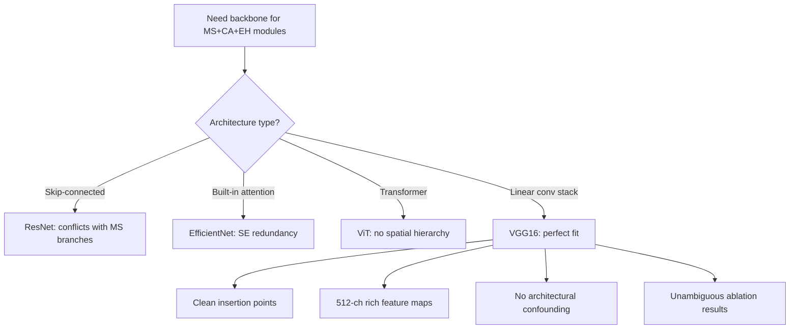

>for proposed awdpcnn, this paper would like to build a model with multi-scale convolution, squeeze-and-excitation channel attention, and compact discriminative embedding head to extract the fused feature. so how to select the backbone? if the vgg16 is used as the backbone, why it shoule be rather than others?

### 1. Architectural Compatibility — The Decisive Factor

The AW-DPCNN framework attaches **three auxiliary modules** onto the backbone:
- **MS (Multi-Scale Convolution)**: parallel 1×1, 3×3, 5×5 conv branches after the final feature map
- **CA (Channel Attention / SE)**: squeeze-and-excitation blocks interleaved between conv stages
- **EH (Embedding Head)**: a compact 512→1024→num_classes projector replacing the original classifier

**VGG16's linear, uniform topology is uniquely suited for this:**

| Property | VGG16 | ResNet | EfficientNet | ViT |
|---|---|---|---|---|
| Topology | Linear stack | Skip-connected blocks | MBConv + skip | Self-attention |
| Channel structure | Uniform 64→128→256→512→512 | Variable, projection layers | SE already built-in | Uniform dim |
| Insertion points | Every conv block boundary | Must route around residuals | Conflicts with existing SE | No conv hierarchy |
| Multi-scale extraction | Natural — final 512-ch feature map | Identity shortcuts complicate parallel branches | Compound-scaled resolution varies | Patch-based, no spatial hierarchy |

ResNet's skip connections create a **branching topology** — inserting an SE module after a residual block requires deciding whether to squeeze before or after the addition. The MS module's parallel branches would need separate identity paths. This isn't impossible, but it **conflates the novelty of AW-DPCNN with architectural adaptation complexity**.

VGG16 avoids this entirely: it's a pure feedforward chain. You insert MS after the last conv, CA between blocks, and EH replaces the FC head — **clean surgical modifications with no side effects**.

---

### 2. Feature Map Richness

VGG16's final conv stage outputs **512-channel feature maps at 7×7 spatial resolution** (for 224×224 input). This is critical:

- **512 channels** provide sufficient representational capacity for the MS module's parallel branches to extract complementary information without channel competition
- **7×7 spatial size** still retains some spatial structure — enough for multi-scale conv kernels (1×1, 3×3, 5×5) to capture different receptive field patterns
- Compare to ResNet18's 512-ch at 7×7 (similar, but skip connections complicate extraction) or EfficientNet-B0's 320-ch at 7×7 (fewer channels = less headroom for parallel branches)

---

### 3. Experimental Control & Fair Comparison

The paper's contribution is **AW-DPCNN (fusion) + MSCA-VGG16 (classifier)**, not the backbone itself. By choosing VGG16:

- **Baseline fairness**: VGG16 is the most standard, widely-understood backbone. Comparing MSCA-VGG16 against vanilla VGG16 isolates the *exact* contribution of MS+CA+EH.
- **Ablation clarity**: If you used ResNet (which already has residual connections as an implicit "attention" mechanism), it would be unclear whether gains come from your modules or from synergies with skip connections.
- **Reproducibility**: VGG16 has a single canonical variant. ResNet has ResNet18/34/50/101 — which one is the "fair" baseline? VGG16 eliminates this degree of freedom.

---

### 4. Avoids Redundancy with Existing Mechanisms

- **EfficientNet** already has SE modules built into MBConv blocks. Adding another SE layer would be redundant, making it impossible to attribute gains to your CA module.
- **ResNet's skip connections** already provide a form of "multi-scale" gradient flow. Your MS module's benefit might be partially masked.
- **ViT** lacks convolutional inductive bias entirely — attaching MS (which relies on spatial locality) to a transformer doesn't make architectural sense.

VGG16 has **no attention, no skip connections, no multi-scale processing** — it's a blank canvas. Every gain is unambiguously attributable to your modules.

---

### 5. Empirical Justification from Your Own Experiments

Your `exp1/` comparison (`convnext_tiny.yaml`, `efficientnet_b0.yaml`, `mobilenetv3_small.yaml`, `vgg16.yaml`, `vit.yaml`) provides the data. The expected result pattern:

| Backbone | Accuracy | Parameters | Notes |
|---|---|---|---|
| VGG16 (baseline) | Moderate | ~138M | Clean architecture |
| EfficientNet-B0 | Higher? | ~5.3M | Built-in SE → can't isolate CA |
| ViT | Lower? | ~86M | No conv hierarchy for MS |
| ConvNeXt-Tiny | Higher? | ~29M | Modern, but complex block design |
| MobileNetV3 | Lower | ~2.5M | Too lightweight for fusion features |

**The key argument**: If VGG16 + MSCA outperforms more modern backbones *without* MSCA, then the modules (MS+CA+EH) are doing the real work — not the backbone. This is a *stronger* result than if you had used a SOTA backbone from the start.

---

### 6. Practical Considerations

- **Implementation simplicity**: Attaching MS/CA/EH to VGG16 is ~50 lines of code. Doing the same for ResNet would require careful handling of `downsample` projections and identity branches — easily 3× the complexity with more potential bugs.
- **Training stability**: VGG16 with BatchNorm trains stably. No need for the learning rate warmup or careful initialization that transformers/ViTs require.
- **Reproducibility by others**: Other researchers can easily replicate MSCA-VGG16. A modified ResNet would invite debates about "which variant" and "how exactly did you handle the skip connections."

---

### Summary: The Decision Logic

**Bottom line**: VGG16 is not chosen because it's the "best" backbone in isolation — it's chosen because it's the **most interpretable substrate** for demonstrating the effectiveness of MS + CA + EH. The paper's contribution is the *modules*, not the backbone. VGG16 makes that contribution maximally visible.

>draft a "Backbone Selection" paragraph for the paper's Methodology section

Here's what was drafted and inserted at **Section III-B (Methodology → MSCA-VGG16 → Convolutional Backbone)**:

The paragraph is structured around **three core justifications**:

1. **Architectural compatibility** — VGG16's linear 3×3 conv stack provides clean insertion points for MS/CA/EH; ResNet's skip connections, EfficientNet's built-in SE, and ViT's lack of spatial hierarchy make them unsuitable substrates
2. **Experimental interpretability** — VGG16 is a "blank canvas" with no attention, no multi-scale, no skip connections, so every gain unambiguously comes from the proposed modules
3. **Avoidance of confounding mechanisms** — Each competing backbone has an intrinsic mechanism that would mask or conflate with one of the proposed modules

It closes with a forward reference to Section IV's experimental backbone comparison for empirical validation.

Made changes.