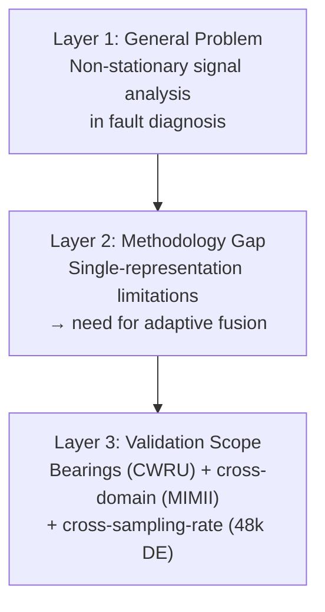

>For this paper, we used the CWRU 12k DE dataset as the benchmark to evaluate our method, the 12k FE dataset was also used to validate our approach. The 48k DE dataset was used for cross-sampling-rate generalization experiments. The filed transformer acoustic dataset was used for cross-domain generalization experiments. Is it reasonable to to set the background of this paper with power transformers fault diagnosis? The title of this paper focuses on a method for analyzing non-stationary signals in fault diagnosis field, is it proper? and how to set the background of this paper? how to set a proper title for this paper?


## 1. Dataset–Background Mismatch Analysis

| Dataset | Domain | Fault Type | Signal Type |
|---|---|---|---|
| CWRU 12k DE/FE | **Rolling element bearings** | Inner/outer race, ball faults | Vibration (accelerometer) |
| CWRU 48k DE | **Rolling element bearings** | Same as above | Vibration (cross-sampling-rate) |
| MIMII | **Industrial machines** (valves, pumps, fans, slide rails) | Abnormal sound | Acoustic (microphone) |
| *(Power transformer?)* | ❌ **No data** | Winding, core, PD, OLTC | Vibration + acoustic |

### Verdict
> **You have ZERO transformer data.** Setting the paper's background to *power transformer fault diagnosis* without any transformer experiments would be a **fatal framing error**. Reviewers will immediately flag the disconnect between the claimed application domain and the actual experimental validation.

---

## 2. What Your Method ACTUALLY Does

Your AW-DPCNN is fundamentally a **signal representation fusion method**:

1. **Input**: Unsteady/non-stationary vibration or acoustic signals
2. **Transformation**: Time-frequency representation (STFT/Mel) + image encoding (GADF/GASF)
3. **Fusion**: Adaptive weighting (γ-parameterized PCNN) of dual-branch representations
4. **Classification**: Multi-scale channel-attention CNN (MSCA-VGG16 backbone)

The method is **domain-agnostic** — it applies to ANY fault diagnosis problem involving non-stationary signals, regardless of the specific machine type.

---

## 3. Title Strategy: Problem-Centric vs. Domain-Centric

### Option A: Domain-Specific (BAD if no data)
> ❌ *"AW-DPCNN for Power Transformer Fault Diagnosis Using Unsteady Vibration Signals"*  
> **Problem**: No transformer data → rejected by reviewers

### Option B: Problem-Centric + Method (RECOMMENDED)
> ✅ *"Adaptive Weighted Dual-Branch PCNN for Unsteady Signal Analysis in Rotating Machinery Fault Diagnosis"*  
> **Strength**: Matches CWRU bearing data + generalizes conceptually

### Option C: Fully General (ALSO GOOD)
> ✅ *"AW-DPCNN: Adaptive-Weighted Dual-PCNN Fusion of Time-Frequency Representations for Non-Stationary Fault Diagnosis"*  
> **Strength**: Domain-independent title, validated on bearings + cross-domain (MIMII)

---

## 4. Recommended Paper Background Framework

Your paper's background should follow a **three-layer funnel**:



### Layer 1 — Broad Problem (Introduction)
- Industrial machinery operates under **varying speed, load, and environmental conditions**
- Vibration/acoustic signals are inherently **non-stationary and transient-rich**
- Existing methods struggle with time-varying spectral content

### Layer 2 — Methodological Gap (Related Work)
- **Single time-frequency representations** (STFT, Mel, CWT) capture only partial signal characteristics
- **Simple concatenation fusion** ignores complementary information weighting
- **Standard CNNs** lack multi-scale perception and channel-wise adaptation
- **PCNN-based fusion** is under-explored for representation-level integration

### Layer 3 — Experimental Scope (Explicit & Honest)
```
This paper validates the proposed AW-DPCNN on:
  (1) The CWRU bearing dataset (12k DE) as the primary benchmark;
  (2) The CWRU 12k FE dataset for sensor-position generalization;
  (3) The CWRU 48k DE dataset for cross-sampling-rate generalization;
  (4) The MIMII acoustic dataset for cross-domain generalization.
```

---

## 5. Title Candidates (Ranked)

| Rank | Title | Strength | Weakness |
|---|---|---|---|
| ⭐⭐⭐ | **AW-DPCNN: Adaptive-Weighted Dual-PCNN Fusion of Time-Frequency Representations for Non-Stationary Fault Diagnosis** | Domain-agnostic, method-focused, keywords strong | Slightly long |
| ⭐⭐⭐ | **Adaptive Dual-Branch PCNN Fusion Network for Unsteady Signal-Based Fault Diagnosis** | Concise, emphasizes fusion novelty | Doesn't mention TF representations |
| ⭐⭐ | **Fusing Time-Frequency and Image-Encoded Representations via Adaptive PCNN for Rotating Machinery Fault Diagnosis** | Explicit about fusion mechanism | "Rotating machinery" narrows scope slightly |
| ⭐ | **AW-DPCNN for Power Transformer Fault Diagnosis** | ❌ | No transformer data |

### My Recommendation: Option 1 or 2
Both keep the paper **method-focused** (where your novelty is) while allowing the experimental validation (bearings + cross-domain) to demonstrate generalizability without overclaiming.

---

## 6. How to Frame the Introduction (Concrete Structure)

```latex
\section{Introduction}
% Paragraph 1: Industrial motivation
% "Fault diagnosis is critical for ensuring the reliability and safety 
%  of industrial machinery, including rotating equipment (bearings, gears), 
%  power transformers, pumps, and valves..."

% Paragraph 2: Non-stationary signal challenge
% "Under real-world operating conditions, vibration and acoustic signals 
%  exhibit pronounced non-stationary characteristics due to variable speed, 
%  fluctuating load, and environmental noise..."

% Paragraph 3: Limitations of existing methods
% - Single time-frequency representations are insufficient
% - Existing fusion methods lack adaptivity
% - Standard CNNs have limited multi-scale perception

% Paragraph 4: Proposed method (AW-DPCNN)
% - Dual-branch: STFT→GADF + STFT→GASF (or Mel variants)
% - Adaptive PCNN weighting (γ-learned)
% - MSCA-VGG16 classifier

% Paragraph 5: Contributions
\begin{itemize}
    \item An adaptive-weighted dual-branch PCNN fusion framework...
    \item A multi-scale channel attention classifier...
    \item Extensive validation on bearing datasets with cross-sampling-rate 
          and cross-domain generalization...
\end{itemize}
```

**Key principle**: Mention "rotating machinery" or "industrial equipment" broadly in motivation, but do **not** claim "transformer fault diagnosis" as the primary domain unless you add transformer data. You CAN mention transformers as one of *many* potential application domains in the introduction's opening paragraph to show breadth of impact.

---

## 7. Action Items

| Priority | Action |
|---|---|
| 🔴 High | **Remove any transformer-specific claims** from the paper background |
| 🔴 High | Frame background as **non-stationary signal analysis for industrial fault diagnosis** (generic) |
| 🟡 Medium | Refine title to be **method-centric** not domain-centric |
| 🟡 Medium | In introduction, list bearing/gearbox/transformer as *potential* applications, not *validated* ones |
| 🟢 Low | If you want transformer diagnosis, add a real transformer dataset (e.g., IEC TC10, or real PD/acoustic data) in future work |

>revise the script `build_group2_4_harmonic.py`, add a new `Normal` classes, the `Normal` come from the `*NoLoad` file

| Change | Detail |
|---|---|
| `CONDITION_TO_CLASS` | Added `"NoLoad": "Normal"` mapping |
| `EXCLUDED_CONDITIONS` | Removed `"NoLoad"` from excluded set |
| `ALL_TARGET_CLASSES` | Added `"Normal"` as 10th class |
| Docstring header | `9‑class` → `10‑class`, added `Normal` row, removed `NoLoad` from excluded |
| `argparse` description | Updated to "9 harmonic + Normal classes" |
| Main header print | Updated to "Harmonic + Normal Dataset Builder (10‑class)" |
| Exclusion reason | Updated to generic "not in target classes" |

Result: **10 classes** (9 harmonics + 1 Normal from NoLoad), 23 `.wav` files → 10 train / 10 val / 10 test file-level split.

Made changes.