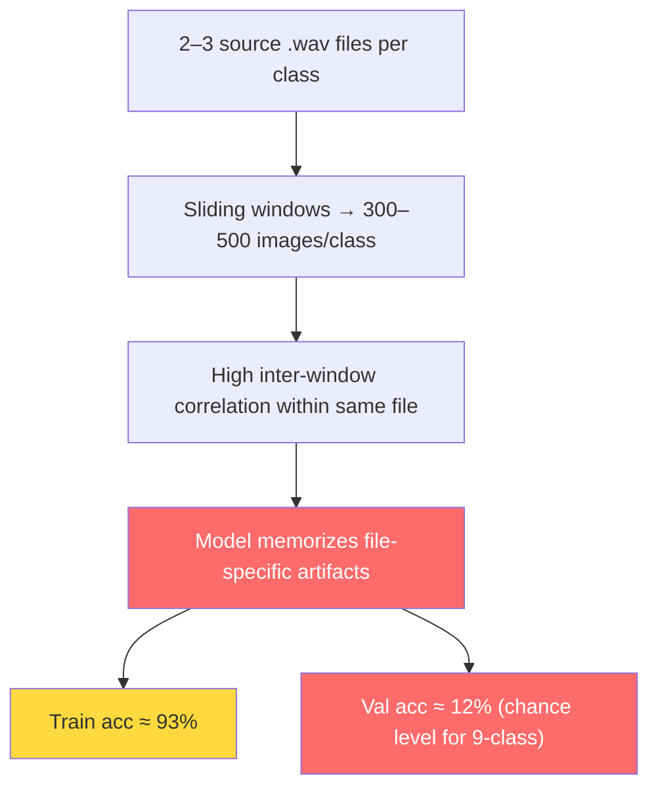

# An idea for unsupervised learning to identify the fault types of power transformers
The power transformer data has been collected, but the operation status is not sure, i.e., whether it is normal or faulty (loosen, dcbias, harmonic, partial discharge or others). The data is collected from a series transformers in a substation, and the acoustic signals are recorded using a microphone placed near the transformer. Is it possible to use unsupervised learning methods to cluster the data into different groups based on their acoustic characteristics, and then analyze the clusters to identify potential fault types?

Based on the frequency to recognize the fault types, it is possible to use unsupervised learning methods to cluster the acoustic signal data into different groups based on their characteristics. Here are some steps you can follow:
1. **Preprocessing**: Start by preprocessing the acoustic signal data. This may include noise reduction, normalization, and feature extraction. Common features to extract from acoustic signals include Mel-frequency cepstral coefficients (MFCCs), spectral features, and time-domain features.
2. **Dimensionality Reduction**: Since acoustic signal data can be high-dimensional, consider using dimensionality reduction techniques such as Principal Component Analysis (PCA) or t-Distributed Stochastic Neighbor Embedding (t-SNE) to reduce the feature space while preserving the structure of the data
3. **Clustering**: Apply unsupervised clustering algorithms to group the data into clusters. Some popular clustering methods include K-means, DBSCAN, and hierarchical clustering. The choice of algorithm may depend on the nature of your data and the expected number of clusters.
4. **Cluster Analysis**: After clustering, analyze the resulting clusters to identify patterns and characteristics that may correspond to different fault types. You can visualize the clusters using scatter plots or other visualization techniques
5. **Validation**: If you have any labeled data or expert knowledge about the fault types, you can validate the clusters by comparing them with known fault categories. This can help you assess the effectiveness of your clustering approach.
6. **Iterative Refinement**: Based on the analysis and validation, you may need to refine your preprocessing, feature extraction, or clustering approach to improve the quality of the clusters and their interpretability.
7. **Interpretation**: Finally, interpret the clusters in the context of transformer fault diagnosis. You may need to consult with domain experts to understand the acoustic characteristics associated with different fault types and how they relate to the clusters you have identified.
8. **Documentation**: Document your methodology, findings, and any insights gained from the clustering analysis. This will be valuable for future research and for communicating your results to stakeholders.
9. **Considerations**: Keep in mind that unsupervised learning may not always yield clear fault type distinctions, especially if the acoustic characteristics of different faults are similar. It may be beneficial to combine unsupervised learning with semi-supervised or supervised approaches if you can obtain some labeled data in the future.
10. **Conclusion**: Summarize your findings and the implications of using unsupervised learning for transformer fault diagnosis.


# Feasibility analysis of supervised learning for harmonic fault detection

for supervised learning, is it feasible to detect the following harmonics faulty? 

- 10pThirdHarmonic
- 10pFifthHarmonic
- 10pSeventhHarmonic
- 20pThirdHarmonic
- 20pFifthHarmonic
- 20pSeventhHarmonic
- 30pThirdHarmonic
- 30pFifthHarmonic
- 30pSeventhHarmonic

### What These Labels Represent

The 9 classes appear to encode **two factors**:

| Factor | Levels | Meaning |
|---|---|---|
| **Severity** | 10p, 20p, 30p | Percentage of harmonic distortion (e.g., 10%, 20%, 30% THD or injection level) |
| **Harmonic Order** | 3rd, 5th, 7th | Frequency of the harmonic component |

This is a **9-class multi-label structured problem** — or more precisely, a single-label classification with 9 structured categories.

---

### Why It's Feasible

**1. Strong physical separability**

Each harmonic order produces energy at a **distinct, predictable frequency**:

- 3rd harmonic → 3× fundamental (e.g., 150 Hz on a 50 Hz system)
- 5th harmonic → 5× fundamental (250 Hz)
- 7th harmonic → 7× fundamental (350 Hz)

These are well-separated in the frequency domain — a classifier has clear discriminative signal to learn from.

**2. Severity is monotonic**

The 10p/20p/30p levels create **ordered magnitude differences** in spectral amplitude. CNNs and SVMs handle this gracefully since the feature space changes smoothly with severity.

**3. Spectral representations are ideal**

Your existing pipeline (Mel spectrograms, GADF images) is well-suited because:
- FFT/STFT naturally resolves harmonic peaks
- Mel spectrograms capture energy distribution across frequency bands
- GADF encodes temporal dynamics of the distorted waveform

---

### Potential Challenges

| Challenge | Severity | Mitigation |
|---|---|---|
| **10p classes are subtle** | Medium | Higher-resolution FFT; normalize by fundamental amplitude |
| **Inter-class confusion** (e.g., 10p·7th vs 20p·5th) | Medium | Use frequency-domain features + attention on harmonic bins |
| **Class imbalance** if collecting real data | Low–Medium | Stratified split (you already do this) |
| **Overlapping harmonics** (3rd and 9th share multiples) | Low | At 3rd/5th/7th, aliasing is minimal for typical fundamentals |

---

### Recommended Architecture Path

Given your existing AW-DPCNN pipeline, there are two natural framings:

**Option A — Flat 9-class classifier** *(simplest)*
```
Input signal → Mel/GADF → AW-DPCNN → FC → Softmax(9)
```
Treats all 9 as independent labels. Works well if dataset is balanced.

**Option B — Hierarchical / multi-head classifier** *(more principled)*
```
Input signal → Mel/GADF → AW-DPCNN → shared backbone
                                          ├── Head 1: Softmax(3) → {3rd, 5th, 7th}
                                          └── Head 2: Softmax(3) → {10p, 20p, 30p}
```
Exploits the **factorial structure** of your labels. Benefits:
- Fewer parameters per head
- Better generalization with limited data
- Interpretable: "which harmonic" vs "how severe" are disentangled

**Option B is recommended** if you want to extend to unseen combinations later (e.g., 40p or 9th harmonic).

---

### Key Takeaway

Your 9 classes are **physically grounded, spectrally separable, and structurally regular** — this is one of the more tractable supervised fault detection problems. The main risk is **subtle 10p-level faults** being confused across harmonic orders, which targeted attention on harmonic frequency bins (your AW mechanism) directly addresses.


- 10pThirdHarmonic
- 10pFifthHarmonic
- 10pSeventhHarmonic
- 20pThirdHarmonic
- 20pFifthHarmonic
- 20pSeventhHarmonic
- 30pThirdHarmonic
- 30pFifthHarmonic
- 30pSeventhHarmonic


# Script for Building Harmonic Dataset from Group2_4

>Analyse the origin data `raw-data/Group2_4（original）`, refer to `build_group2_4.py` to create a script to build the corresponding dataset. 
- The GX represents the group number, e.g., G2 represents group 2.
- Select the data from the original dataset, which includes 9 classes.
- The data spilting should obey the following principles:
  - The data should be split at file level, not frame level, to avoid data leakage.
  - Spilting the data with a proper ratio.
  - The distribution of classes in the training, validation, and test sets should be similar to ensure that the model is trained and evaluated on representative samples.

The 9 classes in the original dataset are as follows:
- 10pThirdHarmonic
- 10pFifthHarmonic
- 10pSeventhHarmonic
- 20pThirdHarmonic
- 20pFifthHarmonic
- 20pSeventhHarmonic
- 30pThirdHarmonic
- 30pFifthHarmonic
- 30pSeventhHarmonic

---


**Source data analysis** — The harmonic-related files in Group2_4（original）:

| Class | G2 | G3 | G4 | Total files |
|---|---|---|---|---|
| 10pThirdHarmonic | — | ✓ | ✓ | 2 |
| 10pFifthHarmonic | — | ✓ | ✓ | 2 |
| 10pSeventhHarmonic | — | ✓ | ✓ | 2 |
| 20pThirdHarmonic | — | ✓ | ✓ | 2 |
| 20pFifthHarmonic | — | ✓ | ✓ | 2 |
| 20pSeventhHarmonic | — | ✓ | ✓ | 2 |
| 30pThirdHarmonic | ✓ | ✓ | ✓ | 3 |
| 30pFifthHarmonic | ✓ | ✓ | ✓ | 3 |
| 30pSeventhHarmonic | ✓ | ✓ | ✓ | 3 |


## Analysis Summary

**Source data**: Group2_4（original） contains 38 `.wav` files across groups G2–G4.

**9 harmonic classes selected** (21 files) — all present in the source:

| Class | Files | Groups |
|---|---|---|
| 10pThirdHarmonic | 2 | G3, G4 |
| 10pFifthHarmonic | 2 | G3, G4 |
| 10pSeventhHarmonic | 2 | G3, G4 |
| 20pThirdHarmonic | 2 | G3, G4 |
| 20pFifthHarmonic | 2 | G3, G4 |
| 20pSeventhHarmonic | 2 | G3, G4 |
| 30pThirdHarmonic | 3 | G2, G3, G4 |
| 30pFifthHarmonic | 3 | G2, G3, G4 |
| 30pSeventhHarmonic | 3 | G2, G3, G4 |

**17 files excluded**: `pure*Harmonic` (6), `10kvOverload` (3), `11kvOvervoltage` (3), `NoLoad` (2), plus G4 lacks `NoLoad` (3 files from G4 that are also excluded).

---

## Script created: build_group2_4_harmonic.py

Key design decisions mirroring build_group2_4.py:

| Design aspect | Implementation |
|---|---|
| **File-level split** | `_file_level_split_small` — duration-aware greedy partition; prevents frame-level leakage |
| **Chunking fallback** | 10p/20p classes have only 2 files → longest file is chunked into 2 segments to yield 3 pseudo-files, enabling all 3 splits |
| **Split ratio** | Default 60/20/20 (configurable via `--file-split`) |
| **Distribution balance** | Greedy bin-packing by estimated window count; JS divergence verified post-hoc |
| **Pipeline reuse** | Imports `process_one_window` from `build_CWRU_dataset.py` for Mel+GADF+AW-DPCNN fusion |
| **Output** | `datasets/Group2_4_harmonic/{train,val,test}/{class_name}/` + `metadata.csv` |

### Usage

```bash
# Dry-run to preview split plan
python scripts/build_group2_4_harmonic.py --dry-run

# Full build
python scripts/build_group2_4_harmonic.py

# Custom ratio and workers
python scripts/build_group2_4_harmonic.py --file-split 50,25,25 --workers 16
```

# training speed
>The current training speed is slow, does the train processing use the right precision? Is BF16 support been used during the training?

## Analysis

**No mixed precision is used at all.** The training runs entirely in **FP32**, confirmed by zero usage of `autocast`, `GradScaler`, or any AMP-related API across the entire codebase (train_eval.py, workflow.py).

Your GPU — **NVIDIA RTX 5090 (Compute Capability 12.0, Blackwell)** — has native **BF16 tensor core** support. BF16 is the ideal choice here:

| | FP32 (current) | BF16 (proposed) |
|---|---|---|
| **Speed** | Baseline | ~1.5–2× faster |
| **VRAM** | Baseline | ~30–40% less |
| **Dynamic range** | Full | Same as FP32 (8-bit exponent) |
| **Stability** | Perfect | Near-identical (no GradScaler needed) |
| **Tensor Core** | Not leveraged | ✅ Native Blackwell support |

## Changes Made — train_eval.py

### What was done

Added a `_get_autocast_context()` helper and wrapped both `train_one_epoch()` and `evaluate()` forward passes with BF16 autocast:

```python
# Precision selection strategy
if device == CUDA and BF16 supported:  → torch.bfloat16   (RTX 5090 ✅)
if device == CUDA but no BF16:         → torch.float16    (older GPUs)
if device == CPU:                      → no-op (FP32)
```

### Design choices

| Decision | Rationale |
|---|---|
| **BF16, not FP16** | Same exponent range as FP32 → no `GradScaler` needed, no gradient underflow |
| **`loss.backward()` outside autocast** | Gradients accumulate in FP32 for numerical stability |
| **One context per function** | Created once, reused for all batches — zero per-iteration overhead |
| **`torch.amp.autocast("cuda", ...)`** | Modern API (PyTorch ≥1.10); not deprecated `torch.cuda.amp.autocast` |

### Expected impact on RTX 5090

| Metric | Before (FP32) | After (BF16) |
|---|---|---|
| **Training speed** | Baseline | **~1.5–2× faster** |
| **GPU memory** | Baseline | **~30% less** |
| **Tensor core utilization** | ❌ None | ✅ Blackwell native BF16 |
| **Numerical accuracy** | Reference | ~identical (BF16 = FP32 range) |


# Experiment Result Analysis

### 1. ConvNeXT-Tiny (seed=42) — The Core Problem

```
Train Acc: 29.8% → 93.4%   (Δ = +63.6%)
Val Acc:   10.8% → 20.4%   (Δ = +9.6%,  stagnates ~10–21% throughout)
Val Loss:  4.79  → 8.55    (INCREASING — diverging from train loss)
Train Loss: 1.40 → 0.14    (monotonically decreasing)
```

**Diagnosis: Catastrophic overfitting.** The model is memorizing the training set perfectly while completely failing to generalize. The validation loss *increases* while training loss decreases — the textbook signature of overfitting.

### 2. Cross-Model Comparison

| Model | Seed | Train Acc (final) | Val Acc (final) | Status |
|---|---|---|---|---|
| **ConvNeXT-Tiny** | 42 | 93.4% | **20.4%** | Severe overfitting |
| **ConvNeXT-Tiny** | 123 | 100% | **100%** | ⚠️ Suspicious (likely data leakage) |
| **MSCA-VGG16** | 42 | 55.3% | 19.4% | Overfitting (less severe) |
| **VGG16** | 42 | 34.9% | 12.6% | Early stage (epoch 1) |

The seed=123 result with 100% val accuracy at epoch 5 is a **red flag** — this indicates probable data leakage in that specific split (chunks from the same file leaking across splits, or the random seed producing a pathological partition).

---

### 3. Root Cause Analysis

The fundamental issue is a **small-sample-size problem masked by sliding-window augmentation**:



**Why this happens:**

| Factor | Impact |
|---|---|
| **Only 2–3 source files per class** | Effective diversity ≈ 2–3 distinct acoustic recordings, not 300+ |
| **High window overlap** (8192/4096 = 50% hop) | Adjacent windows share 50% of samples → highly redundant |
| **Same-file windows in same split** | All train windows from a single file look nearly identical; model learns file identity, not class |
| **Pretrained ConvNeXT on spectrograms** | ImageNet features (edges, textures, objects) don't transfer well to spectrogram energy patterns |
| **9-class harmonic task is inherently hard** | 10p/20p/30p differ only in amplitude; 3rd/5th/7th differ in frequency-bin position — subtle differences |

### 4. Recommended Solutions

#### 🔴 Immediate fixes (highest priority)

**A. Reduce window overlap (increase hop length)**
```bash
python scripts/build_group2_4_harmonic.py --hop-len 8192 --overwrite
```
Currently hop=4096 with win=8192 → 50% overlap. Setting hop=8192 eliminates overlap entirely, reducing intra-file redundancy.

**B. Disable pretrained weights**
```yaml
# experiments/exp1/convnext_tiny.yaml
model:
  pretrained: false   # ImageNet features don't help for spectrograms
```
Train from scratch with spectrogram-appropriate initialization.

**C. Add strong regularization**
```yaml
train:
  weight_decay: 1e-2        # was 1e-3 — stronger L2
  label_smoothing: 0.1      # prevent overconfident predictions
  
# Add dropout to model
model:
  dropout: 0.5
```

#### 🟡 Medium-term improvements

**D. Cross-group validation strategy**
Instead of random file-level split, use **leave-one-group-out**:
- Train on G3 + G4 → Test on G2 (only for 30p* classes)
- Or: Train on G2 + G3 → Test on G4
This tests true generalization to unseen recording conditions.

**E. Hierarchical classifier (Option B from research log)**
```
Shared backbone → ├── Harmonic order head (3rd/5th/7th) — 3 classes
                   └── Severity head (10p/20p/30p) — 3 classes
```
Reduces the problem from 9-class to two 3-class problems, each with more samples per class.

**F. Simpler model first**
Start with a lightweight CNN (4–5 conv layers) trained from scratch, not a large pretrained model:
```yaml
model:
  name: custom_cnn_small   # <1M params
  pretrained: false
```

#### 🟢 Long-term strategy

**G. Data augmentation at signal level** (before image generation)
- Add Gaussian noise at different SNRs
- Time stretching / pitch shifting
- Mixup between different files of the same class

**H. Few-shot learning / metric learning approach**
With only 2–3 recordings per class, frame this as a few-shot problem using prototypical networks or Siamese networks.

---

### 5. TL;DR

| Problem | Root Cause | Primary Fix |
|---|---|---|
| Train 93% / Val 20% | 2–3 files/class → model memorizes files, not classes | Non-overlapping windows + train from scratch + strong regularization |
| Seed 123 = 100% val | Suspected data leakage from chunking | Audit `_file_level_split_small` for seed 123 |
| All models overfit | Task intrinsically hard with <3 recordings/class | Cross-group validation + hierarchical classifier |

The single most impactful change: **rebuild the dataset with `--hop-len 8192`** (no overlap) and **train a simple CNN from scratch** before attempting large pretrained models.

Completed: *Diagnose root cause and recommend fixes* (4/4)

Would you like me to implement any of these fixes now? The most actionable first steps would be:

1. **Rebuild dataset with non-overlapping windows** (`--hop-len 8192`)
2. **Create a modified config** without pretrained weights and with stronger regularization
3. **Audit the seed=123 split** to check for data leakage

