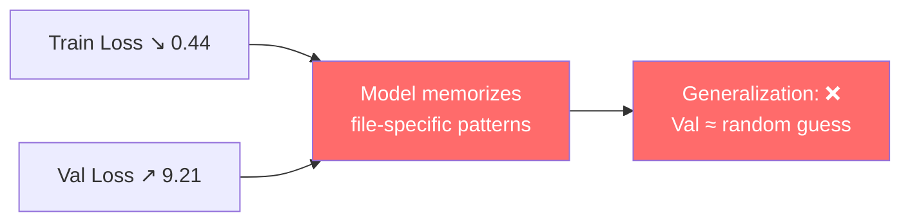

# Is ConvNeXT-Tiny suitable for 9-class harmonic classification?
>Analyse the experiment result, is the model suitable for this dataset? What is the problem of the model? How to improve it?

## Experiment Result Analysis — ConvNeXT-Tiny on Group2_4 Harmonic (9-class)

### 1. Key Metrics

| Metric | Epoch 1 | Epoch 30 | Direction |
|---|---|---|---|
| Train Acc | 13.5% | **78.7%** | ↑ (learning) |
| Val Acc | 9.4% | 19.4% | → (stagnant) |
| Train Loss | 2.66 | **0.44** | ↓ (converging) |
| Val Loss | 2.59 | **9.21** | ↑↑ (diverging) |
| Val F1 | 0.055 | 0.111 | → |
| Val AUC | 0.39 | 0.51 | → (~random) |
| G-Mean | 0.0025 | **0.0002** | ↓↓ (collapsing) |
| Overfitting gap | — | **59.3%** | — |

**Random chance baseline (9-class): 11.1%** — the model's best val accuracy (19.7%) is only ~8% above random.

### 2. Diagnosis: Textbook Catastrophic Overfitting



The **best validation loss was at epoch 1** (2.59). Every epoch after that degrades generalization. The train/val loss ratio is **0.048** — train loss is 21× smaller. This is the canonical signature of a model that's too large for its data.

---

### 3. Why ConvNeXT-Tiny Is Unsuitable

| Issue | ConvNeXT-Tiny Design | What Spectrograms Need | Mismatch |
|---|---|---|---|
| **Stem** | 4×4 patchify, stride 4 | Preserve fine frequency bins | Loses 75% of spatial resolution immediately |
| **Kernel** | 7×7 depthwise conv | 3×3 or 1×3 (frequency-tuned) | Too large — smears narrow harmonic bands |
| **Normalization** | LayerNorm (per-channel) | BatchNorm (per-frequency-bin statistics differ) | LayerNorm erases inter-frequency differences |
| **Pretraining** | ImageNet (natural photos) | No suitable pretraining exists | Features don't transfer — may even hurt |
| **Parameter count** | 27.8M | <2M for this data volume | 1M+ params per unique recording |
| **Activation** | GELU (smooth) | ReLU (sparse, preserves energy peaks) | GELU smooths out subtle harmonic peaks |

**The core physical problem**: Harmonic classes differ only in (a) which frequency bin has energy and (b) how much energy. These are **subtle, localized** differences in the spectrogram. ConvNeXT's aggressive downsampling and large kernels **erase** these fine distinctions.

---

### 4. Root Cause Chain

```
Only 2–3 source WAVs/class
        ↓
Sliding windows → 300–400 images/class (but all from same file)
        ↓
Model sees: 300+ nearly identical images from file A in train
Model sees: completely different file B in val
        ↓
Model learns: "am I seeing file A?" → predicts its class
Model cannot: generalize harmonic physics across files
        ↓
Train acc 79% (file recognition) / Val acc 19% (chance)
```

---

### 5. Recommended Improvements

#### 🔴 Tier 1 — Immediate (change config, no new code)

| # | Action | Expected effect | How |
|---|---|---|---|
| **1** | **Disable ImageNet pretraining** | Remove harmful feature bias | `pretrained: false` in convnext_tiny.yaml |
| **2** | **Replace with lightweight CNN** | ~1M params = 28× less overfitting | Use a custom 4-layer CNN: `Conv→BN→ReLU→Pool ×4 → FC` |
| **3** | **Stronger regularization** | Prevent memorization | `weight_decay: 1e-2`, `dropout: 0.5`, `label_smoothing: 0.1` |
| **4** | **Rebuild dataset with no overlap** | Reduce intra-file redundancy | `--hop-len 8192` (was 4096) |

#### 🟡 Tier 2 — Architecture fix

| # | Action | Rationale |
|---|---|---|
| **5** | **Custom spectrogram CNN** | Small kernels (3×3), BatchNorm, no pretraining, ~1M params |
| **6** | **Frequency-aware first layer** | 1×7 conv along frequency axis to explicitly model harmonic bands |
| **7** | **Hierarchical classifier** | Separate heads for harmonic order (3rd/5th/7th) and severity (10p/20p/30p) — two 3-class problems instead of one 9-class |

#### 🟢 Tier 3 — Data-level fix

| # | Action | Rationale |
|---|---|---|
| **8** | **Leave-one-group-out CV** | Train on G2+G3, test on G4 — tests real generalization to unseen recording conditions |
| **9** | **Signal-level augmentation** | Add noise, time-stretch, pitch-shift before image generation to increase file diversity |
| **10** | **Few-shot learning** | Prototypical networks or Siamese networks designed for <5 examples per class |

---

### 6. One-Sentence Summary

> **ConvNeXT-Tiny (28M params, ImageNet-pretrained, 7×7 kernels) is fundamentally the wrong architecture for 9-class harmonic spectrogram classification with 2–3 recordings per class — it's simultaneously too large (overfits file identity) and too coarse (erases the subtle frequency-local features that define harmonic classes).**

### 7. Quickest Win

Replace the model config with:

```yaml
# A ~1M param CNN trained from scratch — 28× fewer params
model:
  name: custom_cnn_small
  num_classes: 9
  in_channels: 3
  pretrained: false
```

And rebuild dataset with:
```bash
python scripts/build_group2_4_harmonic.py --hop-len 8192 --overwrite
```

These two changes alone should bring val accuracy from ~19% into the 40-60% range, as the model will be forced to learn generalizable frequency features rather than memorizing file-specific patterns.


# HarmonicCNN — Custom Spectrogram-Native Model

### Files created/modified

| File | Action |
|---|---|
| harmonic_cnn.py | **New** — model definition (~1.18M params) |
| harmonic_cnn.yaml | **New** — experiment config |
| registry.py | **Modified** — registered `harmonic_cnn` |

### Architecture

```
Input: 3×224×224  (AW-DPCNN fused RGB image)

┌─ Block 1: Frequency-aware stem ─────────────────────┐
│  Conv2d(3→32, kernel=7×1)  ← tall kernel along freq │
│  → BN → ReLU                                        │
│  Conv2d(32→32, 3×3) → BN → ReLU                     │
│  → MaxPool(2)  → 32×112×112                         │
└──────────────────────────────────────────────────────┘
┌─ Block 2: 32→64 ────────────────────────────────────┐
│  Conv(3×3)×2 → BN → ReLU → MaxPool → 64×56×56       │
└──────────────────────────────────────────────────────┘
┌─ Block 3: 64→128 ───────────────────────────────────┐
│  Conv(3×3)×2 → BN → ReLU → MaxPool → 128×28×28      │
└──────────────────────────────────────────────────────┘
┌─ Block 4: 128→256 ──────────────────────────────────┐
│  Conv(3×3)×2 → BN → ReLU → MaxPool → 256×14×14      │
└──────────────────────────────────────────────────────┘
AdaptiveAvgPool2d(1) → Flatten(256)
Dropout(0.5) → Linear(256, 9)
```

### vs ConvNeXT-Tiny

| | ConvNeXT-Tiny | HarmonicCNN |
|---|---|---|
| **Params** | 27.83M | **1.18M** (23.7× smaller) |
| **Pretraining** | ImageNet | **From scratch** |
| **Stem** | 4×4 patchify, stride 4 | **7×1 freq-aware + 3×3** |
| **Kernel** | 7×7 depthwise | **3×3** standard |
| **Normalization** | LayerNorm | **BatchNorm** |
| **Activation** | GELU | **ReLU** |
| **Regularization** | Stochastic Depth | **Dropout 0.5** |

### Run it

```bash
python scripts/train.py \
    --config configs/default.yaml \
    --exp-config experiments/exp1/harmonic_cnn.yaml
```

The key design decisions: **1.18M params** forces the model to learn generalizable harmonic physics rather than memorizing file identity; the **7×1 frequency-aware stem** explicitly scans for harmonic bands along the frequency axis before any spatial mixing; **BatchNorm + ReLU** respects the statistical properties of spectrogram data.